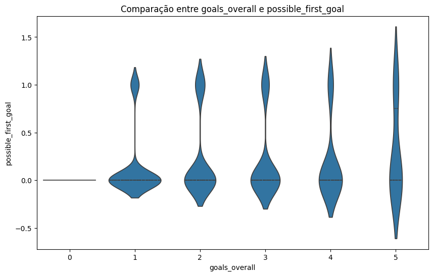

# Documentação Modelo Preditivo - Inteli

## MBI

### Mestres do Placar

#### Arthur Bretas; Bernardo Meirelles; Gabriel Bacci; João Guilherme Salomão; Júlia Alves; Lucas Matheus Nunes; Sophia Senne

## Sumário

[1. Introdução](#c1)

[2. Objetivos e Justificativa](#c2)

[3. Metodologia](#c3)

[4. Desenvolvimento e Resultados](#c4)

[5. Conclusões e Recomendações](#c5)

[6. Referências](#c6)

[Anexos](#attachments)

## 1. Introdução

&nbsp;&nbsp;&nbsp;&nbsp;A IBM, segundo [[1]](#ref1), é uma grande multinacional que, sediada nos Estados Unidos, apresenta operações em mais de 175 países e atua na área de tecnologia da informação, fornecendo infraestrutura, software e serviços de consultoria. A empresa é uma líder global no fornecimento de soluções tecnológicas e possibilita transformações digitais em diversos setores como serviços financeiros, telecomunicações e saúde. Nesse contexto, devido à existência de um camarote da empresa em um estádio de futebol, há necessidade de demonstrar previsões dos resultados das partidas de futebol, a fim de fornecer diversas estatísticas aos espectadores. Além disso, as equipes de futebol também precisam de maior previsibilidade a fim de tomarem decisões estratégicas.

## 2. Objetivos e Justificativa

### 2.1 Objetivos

&nbsp;&nbsp;&nbsp;&nbsp;A IBM, por meio da tecnologia, visa a ajudar clientes a transformarem digitalmente seus negócios e a otimizarem seus processos, melhorando eficiência e competitividade; além de buscar manter e expandir sua posição como líder global em tecnologia da informação e consultoria. Para o projeto em específico, a empresa almeja uma solução que forneça diversas probabilidades e estatísticas acerca de partidas de futebol para análise de estratégias que possam ser aplicadas para múltiplos fins no esporte e, também, para que os fãs dessa modalidade fiquem mais engajados com os jogos.

### 2.2 Proposta de solução

&nbsp;&nbsp;&nbsp;&nbsp;A fim de solucionar a questão apresentada pela IBM, propõe-se um modelo preditivo que, com base em dados coletados a partir do histórico de partidas e técnicas de aprendizado de máquina, prevê o resultado das partidas, identificando o time com mais chances de vitória e o placar provável. O modelo também estima quais jogadores têm maior probabilidade de marcar gols e qual o momento mais provável em que o primeiro gol será marcado. Ao fornecer essas previsões, o modelo não apenas melhora a experiência dos espectadores, mas também fornece dados para equipes e analistas, ajudando-os a tomar decisões estratégicas.

### 2.3 Justificativa
&nbsp;&nbsp;&nbsp;&nbsp;A solução proposta realiza previsões sobre resultados, gols e desempenhos individuais nas partidas de futebol; assim, ela proporciona previsões sobre as partidas antes delas acontecerem por meio de uma interface que busca facilitar a interpretação dos dados por meio de gráficos e representações visuais. Dessa forma, ela oferece dados úteis para demonstrar a capacidade computacional da IBM, a fim de indicar aos clientes possibilidades de soluções a serem criadas pela empresa. Assim, a criação dessa ferramenta abrirá novas oportunidades de negócios, ao fornecer aos usuários uma experiência prática com o modelo preditivo, a qual poderá convencê-los da aplicabilidade de soluções semelhantes em seus próprios empreendimentos.
## 3. Metodologia

&nbsp;&nbsp;&nbsp;&nbsp;Segundo [[2]](#ref2), Crisp-DM é uma sigla para Cross-Industry Standard Process for Data Mining, que em português significa Processo Padrão Inter-Indústrias para Mineração de Dados. O objetivo dessa metodologia é desenvolver modelos a partir da análise de dados de um negócio para prever futuras falhas e soluções. 

&nbsp;&nbsp;&nbsp;&nbsp;Nesse sentido, Crisp-DM é dividida em seis etapas, sendo que as três primeiras etapas têm como objetivo a coleta e organização dos dados a serem analisados:

- *Entendimento do negócio*: define-se o objetivo do projeto e as necessidades da empresa ou projeto em análise.

- *Entendimento dos dados*: começar a pensar nos dados que serão utilizados no processo.

- *Preparação dos dados*: Organização dos dados de modo a conseguirmos enxergar o que eles contam.

&nbsp;&nbsp;&nbsp;&nbsp;As próximas três etapas têm como objetivo a criação do modelo, baseado nas etapas anteriores, e a colocação deste modelo em prática; assim, todo o trabalho anterior será testado e, se necessário, refeito.

- *Modelagem*: A modelagem a ser utilizada deve ser definida de acordo com o problema de negócio e com o tipo de variável a ser analisada. Com a definição de qual modelo será utilizado, devem ser selecionadas as features.

- *Avaliação*: Avaliação se o resultado corresponde à expectativa do projeto. Caso a resposta seja negativa ou a equipe considere que há espaço para melhorias, todas as forças devem ser direcionadas para fazer as mudanças necessárias. 

- *Implementação (deployment)*: O modelo deve ser colocado em produção. A forma depende do tipo de modelo e projeto.

&nbsp;&nbsp;&nbsp;&nbsp;Portanto, a metodologia CRISP-DM é amplamente utilizada em projetos de ciência de dados e mineração de dados, por oferecer uma abordagem sistemática para projetos de ciência de dados, dividindo o trabalho em etapas bem definidas. Dessa forma, o projeto segue um fluxo lógico, minimizando erros e retrabalho. A primeira fase da metodologia, que é focada na compreensão do negócio, garante que os esforços de análise de dados estejam alinhados com as necessidades reais do projeto. Isso evita a criação de modelos ou insights que não têm aplicação prática. Além disso, ao seguir essa abordagem, é mais fácil garantir que as decisões sejam baseadas em dados bem tratados e análises, o que melhora a qualidade dos resultados e facilita a tomada de decisão. Logo, a relevância do CRISP-DM está na capacidade de fornecer uma estrutura organizada e lógica para o desenvolvimento de projetos, garantindo foco nos objetivos de negócio e na qualidade dos resultados.

## 4. Desenvolvimento e Resultados

### 4.1. Compreensão do Problema

#### 4.1.1. Contexto da indústria

Na indústria em que a IBM está inserida, alguns dos grandes nomes que demonstram um nível de competição com a IBM são as empresas Google, Microsoft e Amazon, com seus respectivos serviços (Cloud, Azure, AWS), que oferecem ferramentas e soluções avançadas em computação em nuvem; além de empresas que atuam com dados e inteligência artificial, sendo competidores diretos à iniciativa Watson da IBM, como Meta e OpenAI.

&emsp;&emsp;Nessa indústria, que é altamente competitiva e exige inovação e adaptação constantes para atender as demandas tecnológicas que crescem rapidamente, é necessário sempre estar atento a novas tendências para manter a relevância e posição no mercado. No que tange ao setor, é possível entender que as empresas já citadas como concorrentes da IBM, no segmento de computação em nuvem (Google, Microsoft e Amazon), possuem uma grande parcela do mercado global, já que essas empresas não distribuem apenas soluções robustas e escaláveis, mas também estão continuamente investindo em pesquisa e desenvolvimento para aprimorar seus serviços e atrair uma base de clientes cada vez maior. Sendo assim, compreende-se que, na arena competitiva de mercados tecnológicos, a diferenciação pode ser um fator crítico que indica o sucesso de uma iniciativa. 

&emsp;&emsp;Além disso, a IBM também compete com grandes rivais no setor de inteligência artificial (IA) e análise de dados, utilizando-se da sua plataforma, Watson, para enfrentar soluções como Llama (Meta) e ChatGPT (OpenAI). Essas empresas, especialmente a OpenAI, por estarem num espaço de pionerismo na ampla divulgação de ferramentas de IA, com modelos de linguagem muito avançados e sistemas de aprendizado profundo. É possível dizer que neste setor, existe o fenômeno de "disruptive innovation", conceito que explica uma inovação tecnológica com potencial de transformar radicalmente o setor (Christensen et al., 2015), o que força a IBM a inovar no uso de modelos preditivos, redes neurais e IA para se manter competitiva.

&emsp;&emsp;Modelos de Negócio:
A IBM, assim como seus concorrentes, opera principalmente com um modelo de serviços em nuvem. A empresa oferece uma ampla gama de soluções, desde infraestrutura de nuvem híbrida empresarial até inteligência artificial, segurança e armazenamento de última geração. Além disso, a IBM fornece consultoria para ajudar empresas a implementar essas tecnologias.

&emsp;&emsp;Tendências:
Os serviços em nuvem estão se tornando cada vez mais populares e as empresas estão migrando para ambientes virtuais para obter flexibilidade, reduzir custos e atender às demandas do mercado. A IBM vem diversificando seus serviços em nuvem para atender a essa demanda. A IBM vem trabalhando em soluções de inteligência artificial, o Watson é uma delas. A IBM está comprometida em oferecer soluções seguras para proteger informações, e seu foco em segurança e privacidade se reflete na crescente quantidade de dados armazenados na nuvem. A IBM está investindo em previsões em tempo real, e é bom que eles estejam fazendo algo como o projeto com inteligência. A empresa também está explorando novas tecnologias como blockchain e a internet das coisas.

#### Análise de 5 Forças de Porter

Figura 1 - 5 Forças de Porter.

Fonte: Material produzido pelos autores (2024).

1. Ameaça de Novos Entrantes:
   A ameaça de novos entrantes para a IBM é relativamente baixa devido a barreiras como altos custos de capital, complexidade tecnológica e a necessidade de desenvolvimento especializado. A forte presença da IBM no mercado, como uma marca estabelecida e a base de clientes fiéis dificultam a entrada de novos concorrentes. Mas as startups inovadoras em áreas específicas, como inteligência artificial e blockchain, podem representar uma ameaça em nichos específicos.

2. Poder de Barganha dos Fornecedores:
   O poder de negociação dos fornecedores para a IBM é moderado. A empresa possui uma cadeia de suprimentos diversificada e parcerias estratégicas com vários fornecedores de hardware e software. Porém, em áreas de alta especialização, como chips avançados ou software proprietário, fornecedores específicos podem ter mais influência. IBM também adota práticas de integração vertical em algumas áreas para reduzir sua dependência de fornecedores externos.

3. Poder de Barganha dos Clientes:
   O poder de negociação dos clientes da IBM é alto, especialmente no setor corporativo e em grandes contratos de tecnologia. Clientes grandes e corporativos podem exercer pressão para obter melhores condições, preços mais baixos e serviços personalizados. Além disso, com a crescente concorrência de outros grandes provedores de nuvem e tecnologia, como AWS e Microsoft Azure, os clientes têm mais opções e poder de barganha.

4. Ameaça de Produtos Substitutos:
   A ameaça de produtos substitutos é significativa na indústria de tecnologia e computação em nuvem. Novas tecnologias e soluções, como plataformas open-source, serviços de nuvem mais baratos oferecidos por startups, e inovações em machine learning e big data, podem substituir as ofertas da IBM.

5. Intensidade da Rivalidade Competitiva:
   A rivalidade competitiva nessa indústria é extremamente alta. IBM enfrenta concorrência intensa de outros gigantes da tecnologia como Amazon Web Services (AWS), Microsoft Azure e Google Cloud. A competição é acirrada em termos de preço, inovação tecnológica, qualidade de serviço e suporte ao cliente, o que faz com que a IBM precise continuar produzindo uma forte capacidade de inovação para se destacar no mercado.

#### 4.1.2. Análise SWOT

&ensp;&ensp; [[3]](#ref3) A análise SWOT (Strengths, Weaknesses, Opportunities, Threats) é uma ferramenta estratégica utilizada para identificar os pontos fortes, fracos, oportunidades e ameaças de uma organização.

Figura 2 - Análise SWOT da IBM.

Fonte: Material produzido pelos autores (2024).

 

#### Pontos Fortes (Strengths)

- **Estrutura e alcance global:** Presença robusta em diversos países, muito embasado pela sua presença globalA IBM possui uma presença em diversos países, o que lhe proporciona uma base sólida para explorar mercados diversificados e adaptar-se a diferentes contextos econômicos e culturais.

- **Colaboradores de Ponta:** Equipe altamente qualificada, embasando sempre a empresa para um cenário de inovação. A empresa é reconhecida pela alta qualificação de sua equipe, composta por profissionais de excelência, o que garante inovação contínua e capacidade de desenvolver soluções complexas.
- **Diversificação de Produtos e Serviços:**  A IBM oferece um amplo portfólio que inclui hardware, software, serviços de consultoria e soluções na nuvem, o que permite à empresa atender a uma vasta gama de necessidades de clientes em múltiplos setores atuantes da tecnologia.

#### Pontos Fracos (Weaknesses)

- **Desafios na Transição para a Nuvem:** A IBM enfrenta dificuldades em migrar seus serviços tradicionais para a nuvem, resultando em perda de market share frente a competidores como Microsoft, AWS e Google Cloud. Essa transição lenta impacta a capacidade da empresa de competir efetivamente em um mercado em rápida evolução.
- **Custos Operacionais Elevados:** A IBM possui custos operacionais altos, o que afeta negativamente sua margem de lucro e pode limitar investimentos em inovação e expansão.Entretanto, isso é algo comum na indústria. Hoje, no ramo da IBM qualquer passo em direção a uma tecnologia custa milhões.

#### Oportunidades (Opportunities)

- **Forte desenvolvimento de Inteligência Artificial e Machine Learning:** A IBM tem uma forte tradição em pesquisa e desenvolvimento, especialmente em áreas de alta demanda como IA e aprendizado de máquina, o que abre vastas oportunidades para o desenvolvimento de produtos inovadores, cuja confiaça do cliente é real, não só pela qualidade mas pela tradição que é ser IBM.Além disso, IBM pode expandir o uso de sua plataforma Watson e outras soluções de IA em setores como saúde, finanças e atendimento ao cliente, oferecendo soluções que automatizam processos e melhoram a tomada de decisões.

- **Expansão em Mercados Emergentes:** Com economias em desenvolvimento demonstrando grande potencial de crescimento, a IBM tem a oportunidade de expandir suas operações e capturar novos mercados, especialmente na Ásia, África e América Latina.: A IBM pode adaptar suas ofertas para atender às necessidades específicas desses mercados, como soluções de baixo custo ou infraestrutura tecnológica adaptada às realidades locais.

#### Ameaças (Threats)

- **Variação de Regulações Governamentais de cada país:** Necessidade de adaptação constante. Operar em diversos países implica lidar com regulamentações governamentais variadas e, muitas vezes, conflitantes, que afetam desde a conformidade com leis de proteção de dados até restrições comerciais.

- **Possíveis ataques cibernéticos** Embora a segurança seja uma preocupação para todas as empresas de TI, a IBM, devido ao seu tamanho e importância, pode ser um alvo mais atraente para ciberataques.
Impacto Reputacional: Qualquer violação de segurança significativa pode afetar gravemente a confiança dos clientes e a reputação da marca, além de incorrer em custos legais e de conformidade.

#### Correlação dos Fatos com o Projeto BMI dos Mestres do Placar

&ensp;&ensp;Dado o panorama atual da IBM, com suas forças em inovação e a ameaça de intensa concorrência, o projeto proposto de um modelo preditivo baseado em IA se alinha com as oportunidades identificadas na análise SWOT. Esse modelo pode servir como uma vitrine para as capacidades da IBM em inteligência artificial, reforçando sua posição de liderança tecnológica. Ao integrar esse projeto com as áreas de fraqueza e oportunidade, a IBM pode não apenas explorar novos mercados e melhorar sua reputação em IA, mas também abordar seus desafios operacionais e de transição para a nuvem, fornecendo soluções de alto valor para clientes e diferenciando-se de seus concorrentes.

&ensp;&ensp;Contudo, através dessa análise, podemos inferir que o cenário atual da IBM é uma empresa extremamente estruturada. Com oportunidades de crescimento, a principal delas sendo a inovação tecnológica contínua, a IBM se posiciona de maneira estratégica para explorar novos mercados e expandir suas operações.

&ensp;&ensp; Concluindo, a empresa possui forças significativas, como sua marca reconhecida globalmente, uma vasta experiência no setor de tecnologia e uma base sólida de clientes corporativos. No entanto, a IBM também enfrenta ameaças, como a intensa concorrência no setor de tecnologia, que exige adaptações rápidas e constantes inovações.

#### 4.1.3. Planejamento Geral da Solução

#### Descrição da Solução Preditiva para Partidas de Futebol

&nbsp;&nbsp;&nbsp;&nbsp; No contexto atual do futebol, a utilização de dados e análises preditivas se tornou uma ferramenta fundamental tanto para clubes quanto para fãs. A capacidade de prever eventos em uma partida oferece aos clubes uma vantagem competitiva, permitindo ajustar táticas em tempo real e melhorar o desempenho dos jogadores. Para os fãs, essa tecnologia proporciona uma experiência mais imersiva, ao fornecer probabilidades e análises que aumentam o engajamento durante os jogos.

&nbsp;&nbsp;&nbsp;&nbsp; O presente projeto tem como objetivo desenvolver uma solução preditiva inovadora para medir diversos indicadores críticos em partidas de futebol, como a probabilidade de gols, o desempenho de jogadores e os resultados de jogos. Essa solução será uma vitrine para a capacidade da IBM de aplicar modelos preditivos avançados em cenários complexos e dinâmicos. Podendo assim, demonstrar a aplicabilidade e eficácia de suas tecnologias em análises de grandes volumes de dados e dependendo do contexto utilizar dados em tempo real, para fornecer.

&nbsp;&nbsp;&nbsp;&nbsp; Ao utilizar a infraestrutura robusta e as ferramentas de análise da IBM, como o IBM Watson, a solução proposta não só aprimorará o engajamento dos espectadores, mas também fornecerá dados estratégicos para analistas esportivos e clubes de futebol. Essa abordagem permitirá que as organizações esportivas tomem decisões baseadas em dados com maior precisão, otimizando táticas e estratégias dentro e fora de campo. A solução também servirá como um caso de sucesso para mostrar a adaptabilidade e a eficácia das soluções da IBM em diferentes setores, abrindo portas para futuras oportunidades de negócios em outras indústrias, como finanças, saúde e manufatura.

&nbsp;&nbsp;&nbsp;&nbsp; A parceria com a IBM neste projeto ressalta nosso compromisso em alavancar a tecnologia de ponta para transformar o mercado esportivo, ao mesmo tempo em que posiciona a IBM como líder em soluções de inteligência artificial aplicadas. 

&nbsp;&nbsp;&nbsp;&nbsp; Além disso, este projeto servirá como uma demonstração da capacidade computacional da IBM, evidenciando a aplicabilidade dos seus modelos preditivos em contextos de alta complexidade. Ao utilizar a infraestrutura robusta da IBM, pretendemos atrair potenciais clientes, mostrando como essas soluções podem ser adaptadas para atender a diversas necessidades específicas, desde a otimização de estratégias esportivas até a implementação de sistemas avançados de análise em outras indústrias.

#### Objetivos da Solução

- **Prever o resultado das partidas.**
- **Identificar o jogador que marcará o primeiro gol.**
- **Determinar em qual etapa do jogo (tempo) o primeiro gol será marcado.**
- **Prever o placar final da partida.**
- **Estimar quantos gols cada time fará.**

#### Componentes da Solução

1. **Coleta e Preparação de Dados**

   - **Coleta de Dados:** Reunir dados históricos de partidas, jogadores e estatísticas de jogo de fontes confiáveis, garantindo a integridade e a relevância das informações para o contexto preditivo.
   - **Limpeza e Tratamento:** Implementar processos automatizados para remover dados inconsistentes, tratar valores ausentes e normalizar as informações, assegurando a qualidade dos dados e minimizando interferências nos resultados.
   - **Estrutura dos Dados:** Organizar os dados em estruturas eficientes, prontas para uso em modelos de machine learning, garantindo que todos os aspectos relevantes das partidas estejam adequadamente representados.

2. **Análise Exploratória de Dados (EDA)**

   - **Identificação de Padrões:** Aplicar técnicas avançadas de EDA para identificar padrões ocultos e correlações nos dados, utilizando métodos estatísticos robustos que possam revelar insights estratégicos.
   - **Visualizações:** Desenvolver visualizações dinâmicas e interativas que permitam uma compreensão rápida e eficaz dos dados, facilitando a comunicação dos insights para diversos stakeholders.

3. **Desenvolvimento do Modelo Preditivo**

   - **Seleção de Algoritmos:** Adotar uma abordagem baseada em pesquisa para selecionar os algoritmos de aprendizado supervisionado mais adequados, como Random Forest e Gradient Boosting, assegurando que a solução seja otimizada para precisão e velocidade de processamento.
   - **Treinamento dos Modelos:** Implementar um pipeline de treinamento rigoroso, utilizando técnicas avançadas de ajuste de hiperparâmetros e otimização para maximizar o desempenho dos modelos preditivos.
   - **Validação e Testes:** Realizar uma validação extensa com técnicas como cross-validation e testes em dados não vistos, assegurando a robustez dos modelos e a sua capacidade de generalização.

4. **Implementação e Visualização dos Resultados**

   - **Dashboards:** Criar dashboards altamente personalizáveis e adaptáveis às necessidades dos usuários, com funcionalidades que permitam visualizar previsões em tempo real e análises históricas de forma clara e acessível.
   - **Interface de Usuário:** Desenvolver uma interface de usuário intuitiva e responsiva, que facilite o acesso e a interação com as previsões, garantindo uma experiência fluida e envolvente para todos os perfis de usuários.
   - **Atualizações em Tempo Real:** Integrar a solução com fluxos de dados ao vivo, utilizando tecnologias de ponta para assegurar que as previsões sejam atualizadas em tempo real, mantendo a precisão e a relevância das informações.

5. **Discussão sobre Ética em IA**
   - **Mitigação de Vieses:** Implementar mecanismos de mitigação de vieses nos dados e nos modelos, garantindo que as previsões sejam justas e imparciais, promovendo a equidade no uso de inteligência artificial.
   - **Implicações Éticas:** Abordar as implicações éticas do uso de IA em previsões esportivas, assegurando transparência, responsabilidade e adesão às melhores práticas em inteligência artificial.

#### Benefícios Esperados

- **Melhoria nas Previsões:** Elevar a precisão das previsões de resultados de partidas e eventos específicos, proporcionando um diferencial competitivo para clubes e analistas.
- **Engajamento dos Fãs:** Enriquecer a experiência dos fãs, oferecendo uma jornada interativa com informações e estatísticas em tempo real que aumentam a conexão com o jogo.
- **Insights Estratégicos:** Entregar dados relevantes que podem transformar a abordagem tática dos clubes e otimizar o desempenho em campo, impactando diretamente os resultados esportivos.

#### Conclusão

&nbsp;&nbsp;&nbsp;&nbsp; A solução preditiva que estamos desenvolvendo representa uma interseção poderosa entre tecnologia e esporte, combinando técnicas avançadas de aprendizado de máquina com visualizações intuitivas para fornecer previsões precisas e impactantes. Esta inovação não apenas aumentará o engajamento dos fãs, mas também oferecerá insights estratégicos cruciais para clubes e analistas esportivos. A parceria com a IBM reforça nosso compromisso em liderar a transformação digital no setor esportivo, demonstrando a capacidade da empresa em fornecer soluções de inteligência artificial que agregam valor em diferentes contextos e indústrias.

#### 4.1.4. Value Proposition Canvas

&emsp;&emsp;O Canvas da Proposta de Valor [[4]](#ref4) é uma ferramenta estratégica que ajuda a mapear e entender como um produto ou serviço cria valor para seus clientes. Ele é dividido em seis componentes principais: Tarefas do Cliente, Dores, Ganhos, Produtos e Serviços, Aliviadores de Dores e Criadores de Ganhos. 
&emsp;&emsp;Dessa forma, esclarece-se para cada empresa os produtos e serviços oferecidos (Produtos), os desafios enfrentados pelos clientes (Dores), os benefícios esperados (Ganhos), as necessidades e atividades que desejam realizar (Tarefas do Cliente), como essas soluções podem melhorar suas vidas (Criadores de Ganhos) e resolver problemas específicos (Aliviadores de Dores). 
&emsp;&emsp;Dessa forma, a seguir está a proposta de valor do produto (Figura 3):

Figura 3 - Canvas da Proposta de Valor.

Fonte: Material produzido pelos autores(2024).

 

**1. Tarefas do Cliente**

- **Aprimorar a experiência do consumidor(CX):** Fornecer aos espectadores (clientes e leads) uma experiência envolvente e imersiva antes e durante as partidas.
- **Converter Leads em Vendas**: Os representantes de vendas da IBM precisam convencer os leads de que as soluções da empresa podem ser implementadas com eficácia em seus negócios, resultando em aumento de vendas e/ou redução de custos.
- **Demonstrar o poder computacional e de tecnologia da IBM:** Vendedores da IBM precisam demonstrar capacidade técnica e de inovação, a fim de criar soluções inovadoras e aplicáveis a diferentes contextos de mercado.

**2. Dores**

- **Complexidade na Comunicação dos Benefícios:** Representantes da IBM podem encontrar dificuldades quando alguns clientes acham difícil entender como as tecnologias da IBM podem resolver problemas específicos, devido à complexidade técnica das soluções apresentadas.
- **Dificuldade de conexão de soluções a público:** Necessidade de ampliação do portfólio de produtos que conectem soluções a públicos diversos, isto é, construir produtos que mostrem as aplicações das tecnologias da IBM para problemas de negócios de seus parceiros.

**3. Ganhos**

- **Construção da confiança do consumidor:** O modelo preditivo bem-sucedido demonstra a capacidade técnica e a inovação da IBM, fortalecendo a visão do consumidor final das tecnologias da IBM, com aplicação aos seus contextos de mercado.
- **Maior Conversão em Vendas Esperada:** O modelo preditivo apresentar predições com alta precisão é instrumento de negociação para os representantes comerciais da IBM fecharem uma venda, baseados na expertise, inovação e aplicabilidade da IBM e de suas tecnologias.
- **Experiência Aprimorada no Estádio:** Uma experiência mais rica e completa para os espectadores presentes no estádio, incrementando a *Costumer Experience*, a Experiência do Cliente, o que potencialmente irá influenciar nos processos de negociação e de venda.
- **Geração de Insights Comerciais/de Negócios:** Representantes comerciais da IBM podem utilizar do modelo preditivo como base para vender soluções da IBM aplicadas aos contextos de negócios dos parceiros.

**4. Produtos e Serviços**

- **Modelos Preditivos:** Algoritmos que utilizam aprendizado supervisionado para prever resultados e estatísticas de partidas de futebol, como números de escanteios, de cartões, posse de bola e passes, por exemplo.
- **Aplicativo Web:** Plataforma para os clientes e leads da IBM, exclusivamente no camarote no Allianz Parque, visualizarem previsões, estatísticas e análises da partida, com base em dados históricos, somente.
- **Dashboards Intuitivos:** Visualizações claras e intuitivas das previsões e estatísticas, com o uso de diferentes tipos gráficos dinâmicos, de acordo com a seleção dos dados, disponíveis em painéis, telas e totens no camarote da IBM.

**5. Aliviadores de Dores**

- **Comunicação mais Simples dos Benefícios:** Representantes da IBM podem utilizar o modelo a fim de mostrar como as soluções da IBM ajudam os clientes de forma prática, sem complicações técnicas. Desse modo, as explicações de tecnologia podem ser comunicadas a pessoas leigas, em um contexto simplificado e lúdico de partida de futebol.
- **Ajuste das Soluções para Diferentes Públicos:** Desenvolver produtos que possam ser adaptados para diferentes tipos de negócios, mostrando de forma direta como as tecnologias da IBM podem resolver problemas específicos, conectando as soluções aos diversos públicos de maneira eficaz.

**6. Criadores de Ganhos**

- **Sucesso do Modelo Preditivo em suas predições:** Um modelo preditivo bem-sucedido, conforme as métricas escolhidas previamente, auxilia o representante de vendas da IBM construir a confiança de seus clientes em uma negociação.
- **Melhoria da Experiência no Estádio:** Proporcionar uma experiência mais rica e completa para os clientes e leads da IBM, com estatísticas e previsões do jogo, em seu camarote no estádio Allianz Parque, aumentando a probabilidade de conversão da venda.
- **Facilitação de Insights Comerciais:** Ajudar os analistas da IBM a entender problemas de negócios de seus clientes, em um contexto de descontração em camarote de estádio esportivo, e adaptar suas tecnologias a partir de estratégias de venda e de negócios.
- **Aplicação bem sucedida de tecnologia inovadora:** O sucesso do modelo preditivo, na visão subjetiva dos potenciais clientes da IBM, pode tornar os futuros clientes mais suscetíveis à aplicação de inovação em IA nos seus negócios.

&emsp;&emsp;Ao compreender e aplicar o Canvas da Proposta de Valor, o time de desenvolvimento pode construir soluções mais alinhadas às necessidades e aos interesses do parceiro e dos stakeholders, ao entender de forma profunda o propósito do produto a ser desenvolvido e a sua relação com as expectativas e necessidades do parceiro.
&emsp;&emsp;Além disso, com o uso desse framework, o time de desenvolvimento pode comunicar claramente aos stakeholders da IBM(consultores, representantes comerciais/de negócios, técnicos em UX/UI, em dados, etc) a forma como a solução a ser desenvolvida durante as 10 semanas inclui ao menos um aliviador para cada dor, assim como, um criador para cada ganho, conforme as necessidades e expectativas levantadas durante o kick-off com o parceiro e sumarizaridas nas personas construídas.

#### 4.1.5. Matriz de Riscos

&nbsp;&nbsp;&nbsp;&nbsp;&nbsp;&nbsp;Uma matriz de risco é uma ferramenta utilizada para avaliar e gerenciar os riscos em projetos, processos ou empreendimentos. Ela organiza os riscos em uma matriz, geralmente com eixos que representam a probabilidade de ocorrência e o impacto dos riscos. Isso permite priorizar ações para mitigar ou evitar os riscos mais significativos, ajudando a garantir o sucesso do projeto ou empreendimento. Além disso, é importante ressaltar que a matriz de risco é dinâmica e muda de acordo com o andamento do projeto, pois novos riscos podem surgir, enquanto outros podem se tornar menos relevantes.Portanto, é essencial revisá-la periodicamente para manter o controle eficaz dos riscos ao longo do tempo.

Figura 4 - Matriz de Risco do Projeto

Fonte: Material produzido pelos autores (2024)

| Ameaças                                         | Plano de Ação                                                                                            |
| ----------------------------------------------- | -------------------------------------------------------------------------------------------------------- |
| Falta de comunicação entre os membros da equipe | Praticar a escuta ativa e aprimorar os meios de comunicação para garantir uma colaboração eficaz         |
| Problemas no computador                         | Sempre realizar commits para evitar perdas                                                               |
| Não nos adaptermos com as tecnologias do IBM    | Pedir ajuda para pessoas que ja tenham utilizado essa tecnologia                                         |
| Indisponibilidade de algum membro de grupo      | Redirecionar as tarefas para os outros membros do grupo                                                  |
| Dados imprecisos                                | Verificar e validar os dados fornecidos, comunicando quaisquer inconsistências ao parceiro para correção |
| Não cumprimento dos prazos                      | Buscar comprometimento e atenção aos prazos estabelecidos para evitar atrasos                            |

&nbsp;&nbsp;&nbsp;&nbsp;&nbsp;&nbsp;Assim, quando se trata do desenvolvimento de um projeto, é crucial a realização de uma matriz de risco, a fim de entender as possíveis oportunidades e ameaças que possam afetar no desenvolvimento do projeto.

#### 4.1.6. Personas

&nbsp;&nbsp;&nbsp;&nbsp;&nbsp;&nbsp;[[5]](#ref5) Uma Persona é uma representação fictícia de um usuário ou cliente baseada em pesquisas e dados. Ela é utilizada para ajudar empresas a elevar sua compreensão sobre o comportamento, necessidades, objetivos e motivações de seus clientes, facilitando assim a criação de produtos e serviços alinhados com o público-alvo. Portanto, criamos estas personas voltadas para a IBM:

- Persona 1, Analista de Dados da IBM: Representa os profissionais que trabalham com a análise de dados e extraem informações para apoiar a tomada de decisões estratégicas dentro da empresa. Esse tipo de persona nos permite entender melhor as ferramentas, os recursos e o suporte que esses profissionais precisam para exercer suas funções.

- Persona 2, Vendedor da IBM: Focado em entender os desafios e as necessidades dos profissionais de vendas da IBM, esta persona nos ajuda a criar estratégias e materiais de suporte que permitam a esses profissionais maximizar seu desempenho e atingir suas metas de vendas de forma eficiente.

- Persona 3, Cliente da IBM: Uma representação dos indivíduos ou empresas que adquirem os produtos e serviços da IBM. Compreender essa persona é essencial e nos permite identificar as expectativas, preferências e desafios enfrentados pelos clientes, para que possamos desenvolver soluções que realmente atendam às suas necessidades e superem suas expectativas.

Apresenta, também, uma criação de suas histórias pessoais, motivações, objetivos, desafios e preocupações <a href="#Persona">(André Siqueira, 2022)</a>.

##### 4.1.6.1 Persona 1

Persona Igor Gomes (Figura 5)

Figura 5 - Persona 1  

Fonte: Imagem gerada por IA e Template gerado por autoria própria (2024)

##### Biografia Persona 1

&nbsp;&nbsp;&nbsp;&nbsp;&nbsp;&nbsp; Igor Gomes é um analista de dados brasileiro de 33 anos, reconhecido por sua habilidade em transcrever dados brutos em apersentações informativas. Com uma carreira consolidada na área de análise de dados, ele é apaixonado por descobrir padrões e tendências que impulsionam decisões estratégicas nas empresas.  
&nbsp;&nbsp;&nbsp;&nbsp;&nbsp;&nbsp; Fora do ambiente de trabalho, Igor é um entusiasta dos esportes. Ele acompanha e pratica diversas modalidades, mantendo o equilíbrio entre sua vida profissional e pessoal. Casado e com uma vida familiar harmoniosa, valoriza momentos de qualidade ao lado da família e dedica tempo ao seu desenvolvimento contínuo, tanto no aspecto profissional quanto físico. Seu compromisso com a inovação faz dele um profissional respeitado e renomado.

###### Metas

- Conseguir prever dados estatísticos sobre futebol.
- Elevar a qualidade de vida de sua família.

##### Frustrações

- Dificuldade em conseguir prever acontecimentos em jogos de futebol.
- Não conseguir desenvolver um software que consiga prever os resultados das partidas devido ao conhecimento limitado de programação.

##### Motivações

- O desejo de garantir uma vida estável e segura para a sua família
- A busca pelo maior indice de assertividade possível.
##### Impacto da solução

&nbsp;&nbsp;&nbsp;&nbsp;&nbsp;&nbsp;A solução preditiva de resultados de futebol permitirá que Igor alcance um novo nível de precisão em suas análises. Com essa ferramenta, Igor não apenas aprimora seu desempenho profissional, mas também se destaca no mercado, resultando em oportunidades que aumentam seu capital e, consequentemente, a qualidade de vida de sua família. Essa estabilidade financeira adicional reduz o estresse associado às incertezas profissionais, permitindo-lhe focar ainda mais no desenvolvimento pessoal e no bem-estar familiar, consolidando a segurança e o conforto que ele tanto valoriza para os seus entes queridos.

&nbsp;&nbsp;&nbsp;&nbsp;&nbsp;&nbsp;Como analista de dados, Igor é diretamente impactado pela precisão e confiabilidade do modelo preditivo. A eficiência do modelo influencia seu trabalho e, consequentemente, a qualidade de suas análises.

##### 4.1.6.2 Persona 2

Persona Ricardo Salmão (Figura 6)

Figura 6 - Persona 2  

Fonte: Imagem gerada por IA e Template gerado por autoria própria (2024)

##### Biografia Persona 2

&nbsp;&nbsp;&nbsp;&nbsp;&nbsp;&nbsp;Durante a infância, Ricardo foi inserido ao mundo corporativo, influenciado por seus pais, que eram empresários. Com o desejo de seguir seu próprio caminho, ele decidiu estudar administração, onde aumentou suas habilidades em vendas. Após alguns anos, tornou-se representante de vendas na IBM, onde utiliza seu conhecimento e paixão para oferecer as melhores soluções em tecnologia para empresas de diferentes setores.

##### Metas

- Participar de eventos do setor para fortalecer conexões com potenciais clientes e parceiros.
- Desenvolver um programa de mentoria para novos representantes de vendas na IBM
- Participar de cursos para aprimorar habilidades de apresentação e negociação.

##### Frustrações

- Burocracias que atrasam a entrega de soluções.
- Dificuldades para inovar devido aos recursos limitados.
- Ele enfrenta estresse contínuo devido à necessidade de bater metas de vendas em um ambiente altamente competitivo.

##### Impacto da solução

&nbsp;&nbsp;&nbsp;&nbsp;&nbsp;&nbsp;Para Ricardo, essa solução vai além de um produto a ser vendido, mas também uma é um meio de superar algumas de suas frustrações profissionais. Ao utilizar o modelo preditivo como uma demonstração prática, Ricardo pode destacar o poder computacional da IBM. Essa abordagem permitirá que ele estabeleça conexões mais fortes e confiáveis com potenciais clientes, especialmente em eventos mais informais, como em uma partida de futebol. Assim, Ricardo precisa de uma solução que seja facilmente demonstrável, capaz de impressionar e envolver os clientes desde o primeiro contato, facilitando o processo de venda e ajudando-o a bater suas metas em um ambiente altamente competitivo.

&nbsp;&nbsp;&nbsp;&nbsp;&nbsp;&nbsp;Ricardo é afetado pelo desempenho do modelo preditivo em suas interações de vendas. Sua capacidade de demonstrar os resultados práticos e a importância da solução afetam diretamente suas chances de sucesso durante a venda.

##### 4.1.6.3 Persona 3

Persona Angelica Nobre (Figura 7)

Figura 7 - Persona 3  

Fonte: Imagem gerada por IA e Template gerado por autoria própria (2024)

##### Biografia Persona 3

&nbsp;&nbsp;&nbsp;&nbsp;&nbsp;&nbsp;Angélica Nobre nasceu na cidade de São Paulo e, por influência de seus pais, tornou-se uma torcedora fanática do Palmeiras. Ela sempre teve o sonho de ter sua própria empresa de cosméticos e, após realizar esse sonho e fundar sua empresa, Angélica percebeu a necessidade de um sistema que previsse novas tendências no setor. Para isso, ela entrou em contato com a IBM, buscando aprimorar seu sistema com soluções tecnológicas avançadas.

##### Metas

- Integrar uma soluçao da IBM para prever tendências em um curto período de tempo
- Lançar três novas linhas de cosméticos até o final do ano e dobrar as vendas.
- Crescer 15% no mercado de cosméticos no próximo ano.

##### Frustrações

- Resistência da equipe à adoção de novas ferramentas e processos.
- Despesas inesperadas com a adoção de novas tecnologias
- Desafios na adaptação da equipe com os novos processos e o novo sistema.

##### Motivações

- Desejo de estar à frente das tendências e oferecer produtos diferentes.
- Vontade de expandir e fortalece sua empresa no mercado de cosméticos.
- Objetivo de atender melhor os clientes com produtos que atendam às suas necessidades e desejos.

##### Impacto da solução

&nbsp;&nbsp;&nbsp;&nbsp;&nbsp;&nbsp;Angélica foi convidada para o camarote da IBM devido à sua paixão pelo Palmeiras e, principalmente, pelo potencial que a empresa identificou na aplicação de seu modelo preditivo no setor de cosméticos. Embora o modelo tenha sido originalmente criado para prever estatísticas do campeonato brasileiro, ele pode ser reformulado para identificar tendências no mercado, permitindo a identificação de novas oportunidades de produtos.  
&nbsp;&nbsp;&nbsp;&nbsp;&nbsp;&nbsp;Para que Angélica fique convencida da eficácia da solução, especialmente diante da resistência de sua equipe, a solução precisa demonstrar resultados concretos em um curto período. Ela deve ser intuitiva e de fácil integração com os sistemas já existentes na empresa, minimizando o tempo e os custos de adaptação. Além disso, é crucial que a solução mostre um retorno claro sobre o investimento, permitindo que Angélica visualize, desde os primeiros testes, como a tecnologia pode alavancar o crescimento e a inovação em sua empresa.  
&nbsp;&nbsp;&nbsp;&nbsp;&nbsp;&nbsp;Ao ver na prática a capacidade do modelo preditivo de antecipar tendências, Angélica se sentirá mais confiante em superar as resistências internas e adotar a solução. A promessa de transformar desafios em vantagens competitivas e a possibilidade de expandir sua empresa com decisões baseadas em dados concretos serão fatores decisivos para que ela contrate os serviços da IBM.

&nbsp;&nbsp;&nbsp;&nbsp;&nbsp;&nbsp;Angélica, como cliente da IBM, é diretamente impactada pela capacidade do modelo preditivo de atender às suas necessidades específicas. A confiança na solução afeta suas decisões de implementação, determinando o impacto final nas estratégias e nos resultados da empresa.

##### 4.1.6.4 Responsabilidade dos Desenvolvedores

&nbsp;&nbsp;&nbsp;&nbsp;&nbsp;&nbsp;Os desenvolvedores do modelo preditivo têm a responsabilidade de assegurar que as soluções criadas sejam precisas, éticas e transparentes. O impacto dessas soluções nas personas Igor, Ricardo e Angélica deve ser cuidadosamente considerado, garantindo que o modelo não só atenda às expectativas de cada um, mas também minimize riscos e maximize benefícios.

&nbsp;&nbsp;&nbsp;&nbsp;&nbsp;&nbsp;A jornada do usuário é uma representação visual das etapas que um cliente ou usuário percorre ao interagir com um produto, serviço ou empresa. Ela mapeia os diferentes momentos de contato, identificando as ações, pensamentos, sentimentos, emoções e oportunidades que surgem ao longo desse percurso. O objetivo é entender a experiência do usuário, identificando pontos de melhoria e oportunidades de engajamento.

Figura 8 - Jornada do usuário - Ricardo Salmao

Fonte: Material produzido pelos autores (2024)

&nbsp;&nbsp;&nbsp;&nbsp;&nbsp;&nbsp;A imagem detalha a jornada de Ricardo Salmão, um representante de vendas da IBM, desde a preparação para um evento importante até a fase de expansão e consolidação de uma parceria. Ao longo dessa jornada, Ricardo enfrenta diferentes desafios emocionais e profissionais, desde o nervosismo inicial até a satisfação e motivação ao final do processo. O mapeamento destaca as ações, pensamentos e sentimentos de Ricardo em cada fase, oferecendo uma visão clara de sua evolução emocional e das oportunidades estratégicas que surgem para garantir o sucesso na venda e a manutenção de seu emprego.

#### 4.1.8 Política de Privacidade

&nbsp;&nbsp;&nbsp;&nbsp;A IBM, pessoa jurídica de direito privado, sob o nº (“nós”) leva a sua privacidade a sério e zela pela segurança e proteção de dados de todos os seus clientes, parceiros, fornecedores e usuários (“Usuários” ou “você”).

&nbsp;&nbsp;&nbsp;&nbsp;Esta Política de Privacidade destina-se a informá-lo sobre o modo como nós utilizamos e divulgamos informações coletadas em suas visitas à nossa aplicação e em mensagens que trocamos com você (“Comunicações”).

&nbsp;&nbsp;&nbsp;&nbsp;AO ACESSAR A APLICAÇÃO, ENVIAR COMUNICAÇÕES OU FORNECER QUALQUER TIPO DE DADO PESSOAL, VOCÊ DECLARA ESTAR CIENTE E DE ACORDO COM ESTA POLÍTICA DE PRIVACIDADE, A QUAL DESCREVE AS FINALIDADES E FORMAS DE TRATAMENTO DE SEUS DADOS PESSOAIS QUE VOCÊ DISPONIBILIZAR.

&nbsp;&nbsp;&nbsp;&nbsp;Esta Política de Privacidade fornece uma visão geral de nossas práticas de privacidade e das escolhas que você pode fazer, bem como direitos que você pode exercer em relação aos Dados Pessoais tratados por nós.

&nbsp;&nbsp;&nbsp;&nbsp;Além disso, a Política de Privacidade não se aplica a quaisquer aplicativos, produtos, serviços, sites ou recursos de mídia social de terceiros que possam ser oferecidos ou acessados por meio da Aplicação. O acesso a esses links fará com que você deixe a Aplicação e possa resultar na coleta ou compartilhamento de informações sobre você por terceiros. Nós não controlamos, endossamos ou fazemos quaisquer representações sobre esses sites de terceiros ou suas práticas de privacidade, que podem ser diferentes das nossas. Recomendamos que você revise a política de privacidade de qualquer site com o qual você interaja antes de permitir a coleta e o uso de seus Dados Pessoais.

&nbsp;&nbsp;&nbsp;&nbsp;Caso você nos envie Dados Pessoais referentes a outras pessoas físicas, você declara ter a competência para fazê-lo e declara ter obtido o consentimento necessário para autorizar o uso de tais informações nos termos desta Política de Privacidade.

#### Definições

&nbsp;&nbsp;&nbsp;&nbsp;Para os fins desta Política de Privacidade:

- **“Dados Pessoais”** significa qualquer informação que, direta ou indiretamente, identifique ou possa identificar uma pessoa natural, como por exemplo, nome, CPF, data de nascimento, endereço IP, dentre outros;
- **“Dados Pessoais Sensíveis”** significa qualquer informação que revele, em relação a uma pessoa natural, origem racial ou étnica, convicção religiosa, opinião política, filiação a sindicato ou a organização de caráter religioso, filosófico ou político, dado referente à saúde ou à vida sexual, dado genético ou biométrico;
- **“Tratamento de Dados Pessoais”** significa qualquer operação efetuada no âmbito dos Dados Pessoais, por meio de meios automáticos ou não, tal como a recolha, gravação, organização, estruturação, armazenamento, adaptação ou alteração, recuperação, consulta, utilização, divulgação por transmissão, disseminação ou, alternativamente, disponibilização, harmonização ou associação, restrição, eliminação ou destruição. Também é considerado Tratamento de Dados Pessoais qualquer outra operação prevista nos termos da legislação aplicável;
- **“Leis de Proteção de Dados** [[6]](#ref6) **”** significa todas as disposições legais que regulem o Tratamento de Dados Pessoais, incluindo, porém sem se limitar, a Lei nº 13.709/18, Lei Geral de Proteção de Dados Pessoais (“LGPD”). 
  
#### Uso de Dados Pessoais
&nbsp;&nbsp;&nbsp;&nbsp;Coletamos e usamos Dados Pessoais para gerenciar seu relacionamento conosco e melhor atendê-lo quando você estiver acessando a Aplicação, personalizando e melhorando sua experiência. Exemplos de como usamos os dados incluem:

- Para possibilitar o acesso às informações que disponibilizaremos;
- Para confirmar ou corrigir as informações que temos sobre você; e
- Para entrarmos em contato por um número de telefone e/ou endereço de e-mail fornecido.

&nbsp;&nbsp;&nbsp;&nbsp;Além disso, os Dados Pessoais fornecidos também podem ser utilizados na forma que julgarmos necessária ou adequada: (a) nos termos das Leis de Proteção de Dados; (b) para atender exigências de processo judicial; (c) para cumprir decisão judicial, decisão regulatória ou decisão de autoridades competentes, incluindo autoridades fora do país de residência; (d) para proteger nossas operações; (e) para proteger direitos, privacidade, segurança nossos, seus ou de terceiros; (f) para detectar e prevenir fraude; (g) permitir-nos usar as ações disponíveis ou limitar danos que venhamos a sofrer; (h) de outros modos permitidos por lei.

&nbsp;&nbsp;&nbsp;&nbsp;A NOSSA APLICAÇÃO NÃO SE DESTINA A PESSOAS COM MENOS DE 18 (DEZOITO) ANOS E PEDIMOS QUE TAIS PESSOAS NÃO NOS FORNEÇAM QUALQUER DADO PESSOAL

#### Não fornecimento de Dados Pessoais

&nbsp;&nbsp;&nbsp;&nbsp;Você não é obrigado a compartilhar os Dados Pessoais que solicitamos, no entanto, se você optar por não os compartilhar, em alguns casos, não poderemos fornecer a você acesso completo à Aplicação, a alguns recursos especializados ou ser capaz de prestar a assistência necessária.

#### Dados coletados

&nbsp;&nbsp;&nbsp;&nbsp;O acesso a visualização dos dados depende de cadastro e envio de Dados Pessoais como nome e email.

&nbsp;&nbsp;&nbsp;&nbsp;Ao menos que você informe em algum formulário livre preenchido por você, nós não coletamos Dados Pessoais Sensíveis.

#### Compartilhamento de Dados Pessoais com terceiros

&nbsp;&nbsp;&nbsp;&nbsp;Nós poderemos compartilhar seus Dados Pessoais:

- Com a(s) empresa(s) parceira(s) que você selecionar ou optar em enviar os seus dados, dúvidas, perguntas etc., bem como com provedores de serviços ou parceiros para gerenciar ou suportar certos aspectos de nossas operações comerciais em nosso nome. Esses provedores de serviços ou parceiros podem estar localizados nos Estados Unidos, na Argentina, no Brasil ou em outros locais globais, incluindo servidores para homologação e produção, e prestadores de serviços de hospedagem e armazenamento de dados, gerenciamento de fraudes, suporte ao cliente, vendas em nosso nome, atendimento de pedidos, personalização de conteúdo, atividades de publicidade e marketing (incluindo publicidade digital e personalizada) e serviços de TI, por exemplo;
- Com terceiros, com o objetivo de nos ajudar a gerenciar a Aplicação; e
- Com terceiros, caso ocorra qualquer reorganização, fusão, venda, joint venture, cessão, transmissão ou transferência de toda ou parte da nossa empresa, ativo ou capital (incluindo os relativos à falência ou processos semelhantes).
  Transferências internacionais de Dados

&nbsp;&nbsp;&nbsp;&nbsp;Dados Pessoais e informações de outras naturezas coletadas por nós podem ser transferidos ou acessados por entidades pertencentes ao grupo corporativo das empresas parceiras em todo o mundo de acordo com esta Política de Privacidade.

#### Forma de coleta automática de Dados Pessoais

&nbsp;&nbsp;&nbsp;&nbsp;Quando você visita a Aplicação, ela pode armazenar ou recuperar informações em seu navegador, seja na forma de _cookies_ e de outras tecnologias semelhantes. Essas informações podem ser sobre você, suas preferências ou seu dispositivo e são usadas principalmente para que a Aplicação funcione como você espera. As informações geralmente não o identificam diretamente, mas podem oferecer uma experiência na internet mais personalizada.

&nbsp;&nbsp;&nbsp;&nbsp;De acordo com esta Política de Privacidade, nós e nossos prestadores de serviços terceirizados podemos coletar seus Dados Pessoais de diversas formas, incluindo, entre outros:

- Por meio do navegador ou do dispositivo: Algumas informações são coletadas pela maior parte dos navegadores ou automaticamente por meio de dispositivos de acesso à internet, como o tipo de computador, resolução da tela, nome e versão do sistema operacional, modelo e fabricante do dispositivo, idioma, tipo e versão do navegador de Internet que está utilizando. Podemos utilizar essas informações para assegurar que a Aplicação funcione adequadamente.
- Uso de _cookies_: Os _cookies_ permitem a coleta de informações tais como o tipo de navegador, o tempo despendido na Aplicação, as páginas visitadas, as preferências de idioma, e outros dados de tráfego anônimos. Nós e nossos prestadores de serviços podemos utilizar essas informações para, dentre outros, personalizar sua experiência ao utilizar a Aplicação, assim como para direcionar publicidade para você, de acordo com os seus interesses.
  Caso não deseje que suas informações sejam coletadas por meio de _cookies_, você pode configurar os _cookies_ no menu "opções" ou "preferências" do seu browser.

#### Direitos do Usuário

&nbsp;&nbsp;&nbsp;&nbsp;Você pode, a qualquer momento, requerer: (i) confirmação de que seus Dados Pessoais estão sendo tratados; (ii) acesso aos seus Dados Pessoais; (iii) correções a dados incompletos, inexatos ou desatualizados; (iv) anonimização, bloqueio ou eliminação de dados desnecessários, excessivos ou tratados em desconformidade com o disposto em lei; (v) portabilidade de Dados Pessoais a outro prestador de serviços, contanto que isso não afete nossos segredos industriais e comerciais; (vi) eliminação de Dados Pessoais tratados com seu consentimento, na medida do permitido em lei; (vii) informações sobre as entidades às quais seus Dados Pessoais tenham sido compartilhados; (viii) informações sobre a possibilidade de não fornecer o consentimento e sobre as consequências da negativa; e (ix) revogação do consentimento. Os seus pedidos serão tratados com especial cuidado de forma a que possamos assegurar a eficácia dos seus direitos. Poderá lhe ser pedido que faça prova da sua identidade de modo a assegurar que a partilha dos Dados Pessoais é apenas feita com o seu titular.

&nbsp;&nbsp;&nbsp;&nbsp;Você deverá ter em mente que, em certos casos (por exemplo, devido a requisitos legais), o seu pedido poderá não ser imediatamente satisfeito, além de que nós poderemos não conseguir atendê-lo por conta de cumprimento de obrigações legais.

#### Segurança dos Dados Pessoais

&nbsp;&nbsp;&nbsp;&nbsp;Buscamos adotar as medidas técnicas e organizacionais previstas pelas Leis de Proteção de Dados adequadas para proteção dos Dados Pessoais na nossa organização. Infelizmente, nenhuma transmissão ou sistema de armazenamento de dados tem a garantia de serem 100% seguros. Caso tenha motivos para acreditar que sua interação conosco tenha deixado de ser segura (por exemplo, caso acredite que a segurança de qualquer uma de suas contas foi comprometida), favor nos notificar imediatamente.

&nbsp;&nbsp;&nbsp;&nbsp;Não nos responsabilizamos pelas políticas e práticas de coleta, uso e divulgação (incluindo práticas de proteção de dados) de outras organizações, tais como Facebook, Apple, Google, Microsoft, ou de qualquer outro desenvolvedor de software ou provedor de aplicativo, Loja de mídia social, sistema operacional, prestador de serviços de internet sem fio ou fabricante de dispositivos, incluindo todos os Dados Pessoais que divulgar para outras organizações por meio dos aplicativos, relacionadas a tais aplicativos, ou publicadas em nossas páginas em mídias sociais. Nós recomendamos que você se informe sobre a política de privacidade de cada site visitado ou de cada prestador de serviço utilizado.

#### Atualizações desta Política de Privacidade

&nbsp;&nbsp;&nbsp;&nbsp;Se modificarmos nossa Política de Privacidade, publicaremos o novo texto na Aplicação, com a data de revisão atualizada. Podemos alterar esta Política de Privacidade a qualquer momento. Caso haja alteração significativa nos termos dessa Política de Privacidade, podemos informá-lo por meio das informações de contato que tivermos em nosso banco de dados ou por meio de notificação em nossa Aplicação.

&nbsp;&nbsp;&nbsp;&nbsp;Recordamos que nós temos como compromisso não tratar os seus Dados Pessoais de forma incompatível com os objetivos descritos acima, exceto se de outra forma requerido por lei ou ordem judicial.

&nbsp;&nbsp;&nbsp;&nbsp;Sua utilização da Aplicação após as alterações significa que aceitou as Políticas de Privacidade revisadas. Caso, após a leitura da versão revisada, você não esteja de acordo com seus termos, favor encerrar o acesso à Aplicação.

#### Pessoa responsável do tratamento dos Dados Pessoais

&nbsp;&nbsp;&nbsp;&nbsp;Caso pretenda exercer qualquer um dos direitos previstos nesta Política de Privacidade e/ou nas Leis de Proteção de Dados, ou resolver quaisquer dúvidas relacionadas ao Tratamento de seus Dados Pessoais, favor contatar-nos através do e-mail ibmidsupport@ibm.com.

#### Análise de Dados - Previsões no Campeonato Brasileiro

&nbsp;&nbsp;&nbsp;&nbsp;Esta documentação abrange três frentes de análise preditiva no contexto do Campeonato Brasileiro de Futebol. Cada análise foca em uma questão específica, utilizando dados históricos e técnicas de exploração e pré-processamento. As análises são:

1. **Qual será o primeiro jogador a marcar um gol na partida.**
2. **Qual será o placar final da partida.**
3. **Em qual etapa do jogo será marcado o primeiro gol.**

&nbsp;&nbsp;&nbsp;&nbsp;A seguir, cada análise será detalhada de acordo com as etapas de compreensão dos dados, pré-processamento e formulação de hipóteses, respeitando a estruturação necessária para garantir uma modelagem preditiva eficiente e precisa.

---

## 1. Previsão do Primeiro Jogador a Marcar um Gol

### 4.2.1. Compreensão dos Dados

&nbsp;&nbsp;&nbsp;&nbsp;Compreender os dados é fundamental para qualquer análise preditiva. Nesta seção, exploramos os dados disponíveis para identificar as principais características e relações entre as variáveis que podem influenciar a previsão de qual jogador marcará o primeiro gol.

#### 4.2.1.1. Exploração de Dados

&nbsp;&nbsp;&nbsp;&nbsp;A **Exploração de Dados** é a etapa inicial e crucial na análise de dados. Ela envolve a investigação das estatísticas descritivas e a visualização das variáveis, permitindo uma primeira compreensão sobre a estrutura dos dados e as possíveis relações entre as variáveis.

##### Análise Estatística Descritiva

&nbsp;&nbsp;&nbsp;&nbsp;A **Estatística Descritiva** fornece um panorama das principais características dos dados. Ao analisar os dados de jogadores e partidas, podemos observar variáveis como gols marcados, minutos jogados, e a precisão dos chutes. Essas análises são essenciais para entender a distribuição dos dados e identificar padrões preliminares.

**Quadro 1 - Estatística Descritiva das colunas selecionadas sobre jogadores:**

| **Stat** | **goals_overall** | **goals_per_90_overall** | **min_per_goal_overall** | **shots_on_target_per_90_overall** | **shot_accuraccy_percentage_overall** | **xg_per_90_overall** | **goals_home** | **goals_away** | **rank_in_club_top_scorer** | **minutes_played_overall** | **shots_on_target_per_game_overall** | **average_rating_overall** |
|----------|------------------:|-------------------------:|-------------------------:|-----------------------------------:|--------------------------------------:|----------------------:|---------------:|---------------:|----------------------------:|--------------------------:|-----------------------------------:|----------------------------:|
| **count**| 607.0             | 607.0                    | 607.0                    | 495.0                              | 495.0                                 | 495.0                 | 607.0          | 607.0          | 607.0                        | 607.0                        | 495.0                               | 495.0                         |
| **mean** | 0.3542            | 0.1123                   | 76.1252                  | 0.5022                             | 32.1489                                | 0.1769                | 0.1993         | 0.1549         | 11.346                       | 294.3278                      | 0.2450                              | 6.7365                        |
| **std**  | 0.7780            | 0.4304                   | 173.0877                 | 1.0813                             | 34.1347                                | 0.3933                | 0.5279         | 0.4586         | 9.0307                       | 262.1851                      | 0.3223                              | 0.7407                        |
| **min**  | 0.0               | 0.0                      | 0.0                      | 0.0                                | 0.0                                   | 0.0                   | 0.0            | 0.0            | 0.0                          | -1.0                          | 0.0                                | 0.0                           |
| **25%**  | 0.0               | 0.0                      | 0.0                      | 0.0                                | 0.0                                   | 0.0                   | 0.0            | 0.0            | 3.0                          | 44.0                          | 0.0                                | 6.64                          |
| **50%**  | 0.0               | 0.0                      | 0.0                      | 0.2                                | 25.0                                  | 0.06                  | 0.0            | 0.0            | 11.0                         | 251.0                         | 0.14                               | 6.84                          |
| **75%**  | 0.0               | 0.0                      | 0.0                      | 0.645                              | 50.0                                  | 0.2                   | 0.0            | 0.0            | 19.0                         | 488.0                         | 0.38                               | 7.065                         |
| **max**  | 5.0               | 6.43                     | 893.0                    | 15.0                               | 100.0                                 | 4.44                  | 4.0            | 3.0            | 30.0                         | 900.0                         | 2.0                                | 8.18                          |
| **Tipo** | **Numérica**      | **Numérica**             | **Numérica**             | **Numérica**                       | **Numérica**                          | **Numérica**          | **Numérica**   | **Numérica**   | **Numérica**                 | **Numérica**                  | **Numérica**                        | **Numérica**                  |

Fonte: Material produzido pelos autores (2024)

**Quadro 2 - Estatística das colunas selecionadas sobre Partidas:**

| **Stat** | **home_team_name** | **away_team_name** | **home_team_goal_timings** | **away_team_goal_timings** |
|----------|-------------------:|-------------------:|----------------------------:|----------------------------:|
| **count**| 380                | 380                | 71                         | 62                         |
| **unique**| 20                 | 20                 | 67                         | 57                         |
| **top**  | Internacional       | Bahia              | 42                         | 70                         |
| **freq** | 19                 | 19                 | 3                          | 2                          |
| **Tipo** | **Categórica**      | **Categórica**     | **Categórica**             | **Categórica**             |

Fonte: Material produzido pelos autores (2024)

##### Visualização de Relações entre Colunas

&nbsp;&nbsp;&nbsp;&nbsp;A **Visualização de Dados** é uma etapa essencial que utiliza gráficos para explorar as relações entre as variáveis. Essas visualizações ajudam a destacar correlações e padrões que podem não ser imediatamente evidentes nos dados brutos.

- **Violin Plot - Comparação entre goals_overall e possible_first_goal:** Esse gráfico combina elementos de um boxplot com uma distribuição kernel para mostrar a distribuição dos dados e a densidade em torno da mediana. Ao visualizar a relação entre o número de gols e a probabilidade de marcar o primeiro gol, podemos perceber que jogadores com mais gols tendem a ter uma chance maior de marcar primeiro.

Figura 10 - Violin Plot - Comparação entre goals_overall e possible_first_goal

Fonte: Material produzido pelos autores (2024)

- **Boxplot - Gols por 90 minutos vs Possível Primeiro Gol:** Este gráfico compara a distribuição de gols marcados por 90 minutos com a possibilidade de um jogador marcar o primeiro gol. O gráfico mostra que jogadores classificados como prováveis de marcar o primeiro gol (`True`) têm uma taxa de gols por 90 minutos maior.

Figura 11 - Boxplot - Gols por 90 minutos vs Possível Primeiro Gol

Fonte: Material produzido pelos autores (2024)

### 4.2.2.1. Pré-processamento dos Dados

&nbsp;&nbsp;&nbsp;&nbsp;O **Pré-processamento dos Dados** é uma etapa essencial para preparar os dados para a análise. Aqui, descrevemos as ações realizadas para garantir que os dados estejam limpos e em um formato adequado para a modelagem preditiva.

#### Limpeza dos Dados

&nbsp;&nbsp;&nbsp;&nbsp;A **Limpeza dos Dados** envolve a remoção de inconsistências, valores ausentes e outliers. Estas etapas são cruciais para garantir a precisão dos modelos preditivos.

- **Tratamento de Missing Values:** Linhas com valores ausentes em colunas críticas foram removidas. Isso assegura que apenas dados completos sejam utilizados, eliminando a possibilidade de que informações incompletas comprometam a análise.
- **Remoção de Outliers:** Não foram identificados outliers significativos que precisassem de correção, permitindo que a análise prosseguisse sem necessidade de ajustes adicionais.

#### Transformação dos Dados

**Transformação dos Dados

** envolve ajustar e preparar os dados para a modelagem, garantindo que todas as variáveis estejam em um formato compatível.

- **Codificação:** Valores categóricos foram transformados em valores numéricos usando o `LabelEncoder`. Isso facilita a inclusão dessas variáveis nos modelos preditivos.
- **Normalização:** As variáveis numéricas foram normalizadas para uma escala de 0 a 1, garantindo que todas as variáveis tenham peso igual na modelagem, evitando que variáveis com valores amplos dominem a análise.

### 4.2.3.1. Hipóteses

**Hipóteses** são formuladas para guiar a análise preditiva, baseando-se nas observações iniciais dos dados. Elas servem como uma base para as futuras análises e modelagens.

#### Hipóteses Formuladas

Com base na análise inicial, foram formuladas duas hipóteses principais:

1. **Quanto menor a quantidade média de minutos por gol, maior a probabilidade de marcar o primeiro gol:**
   - A eficiência de um jogador, medida pela quantidade de minutos por gol, pode indicar sua propensão a marcar o primeiro gol. Jogadores que precisam de menos tempo para marcar são mais propensos a ser os primeiros a fazê-lo em uma partida.

2. **Quanto maior a quantidade de gols marcados por um jogador, maior a probabilidade dele marcar o primeiro gol:**
   - Jogadores com um histórico de muitos gols são geralmente os artilheiros de suas equipes. Como esses jogadores são frequentemente os mais envolvidos nas jogadas ofensivas, têm uma maior probabilidade de marcar o primeiro gol na partida.

## 4.2.2.2 Previsão do Placar Final

### 4.2.2. Compreensão dos Dados

&nbsp;&nbsp;&nbsp;&nbsp;Nesta análise, o objetivo é prever o placar final das partidas. Para isso, analisamos dados sobre o desempenho das equipes, incluindo chutes, posse de bola e outras métricas relevantes.

#### 4.2.1.2. Exploração de Dados

&nbsp;&nbsp;&nbsp;&nbsp;A exploração inicial dos dados envolveu a análise de estatísticas descritivas para identificar tendências e padrões no desempenho das equipes. Isso inclui uma análise cuidadosa das variáveis disponíveis para entender melhor as possíveis relações que influenciam o placar final.

##### Análise Estatística Descritiva

&nbsp;&nbsp;&nbsp;&nbsp;A estatística descritiva fornece uma visão abrangente sobre os dados, permitindo identificar padrões, outliers e a distribuição geral das variáveis que serão usadas na modelagem.

#### Visualização de Relações entre Colunas

&nbsp;&nbsp;&nbsp;&nbsp;A visualização dos dados através de gráficos é fundamental para identificar correlações e padrões. Gráficos de dispersão, heatmaps e outros tipos de visualizações foram utilizados para explorar as relações entre as variáveis, como a precisão nos chutes e o número de gols marcados.

- **Gráfico de Dispersão entre Chutes no Alvo e Gols Marcados:**

&nbsp;&nbsp;&nbsp;&nbsp;Este gráfico de dispersão mostra a relação entre o número de chutes no alvo e os gols marcados pelas equipes. A linha de tendência no gráfico sugere uma correlação positiva entre essas duas variáveis, indicando que quanto mais chutes no alvo, maior a probabilidade de marcar gols.

Figura 12 - Scatter Plot - Chutes no Alvo vs Gols Marcados

Fonte: Material produzido pelos autores (2024)

- **Gráfico de Barras comparando Resultado do Jogo e Número de Gols:**

&nbsp;&nbsp;&nbsp;&nbsp;O gráfico de barras abaixo compara o resultado do jogo (vitória, empate, derrota) com o número de gols marcados pelas equipes. Ele ajuda a visualizar como o número de gols impacta diretamente no resultado final da partida.

Figura 13 - Bar Plot - Resultado do Jogo vs Número de Gols

Fonte: Material produzido pelos autores (2024)

- **Matriz de Correlação entre Variáveis Numéricas:**

&nbsp;&nbsp;&nbsp;&nbsp;A matriz de correlação a seguir mostra a força e a direção das correlações entre todas as variáveis numéricas no dataset. Correlações fortes entre variáveis como "Chutes no Alvo" e "Gols Marcados" destacam-se como preditores importantes para o placar final.

Figura 14 - Heatmap de Correlação

Fonte: Material produzido pelos autores (2024)

### 4.2.2.2. Pré-processamento dos Dados

&nbsp;&nbsp;&nbsp;&nbsp;O pré-processamento dos dados é uma etapa crítica que prepara os dados brutos para a modelagem. Nesta fase, garantimos que os dados sejam limpos e transformados adequadamente para que possam ser usados de forma eficiente nos modelos preditivos.

#### Limpeza dos Dados

- **Tratamento de Missing Values:** Os valores ausentes foram cuidadosamente tratados para garantir que a análise não fosse comprometida. Em alguns casos, colunas inteiras com muitos valores ausentes foram removidas, enquanto em outros casos, os dados foram imputados ou as linhas incompletas foram excluídas.

- **Remoção de Outliers:** Outliers foram identificados e removidos para evitar que influenciassem negativamente os resultados da modelagem. Isso foi feito através de técnicas como análise de boxplot, que permite visualizar e remover valores que estão fora do padrão esperado.

#### Transformação dos Dados

- **Normalização:** Os dados numéricos foram normalizados para garantir que todas as variáveis estivessem na mesma escala. Isso é importante para que nenhuma variável domine a análise devido a sua amplitude.
  
- **Codificação:** As variáveis categóricas foram transformadas em variáveis numéricas, utilizando técnicas como One-Hot Encoding ou Label Encoding, tornando-as utilizáveis em modelos de machine learning.

### 4.2.3.2. Hipóteses

&nbsp;&nbsp;&nbsp;&nbsp;Três hipóteses principais foram formuladas para guiar a análise preditiva e a construção de modelos.

1. **A precisão dos chutes no alvo das equipes é um forte preditor do placar final:**
   - A precisão nos chutes é diretamente correlacionada com o número de gols marcados. Portanto, equipes com maior precisão nos chutes tendem a ter um placar final mais favorável.

2. **A expectativa de gols (xG) pré-jogo pode ser um indicador útil, mas deve ser ajustado para prever com precisão o placar final:**
   - O xG é uma métrica popular para prever o desempenho das equipes. No entanto, ela deve ser ajustada para levar em conta fatores contextuais, como a força do adversário e as condições do jogo.

3. **O desempenho da equipe em casa versus fora tem um impacto significativo no resultado do jogo:**
   - Jogar em casa frequentemente proporciona uma vantagem às equipes, o que deve ser levado em consideração ao prever o placar final. Essa vantagem pode estar relacionada ao apoio da torcida, familiaridade com o campo, e outros fatores psicológicos.

## 4.2.2.3. Previsão da Etapa em que será Marcado o Primeiro Gol

### 4.2.3. Compreensão dos Dados

&nbsp;&nbsp;&nbsp;&nbsp;Esta análise foca em prever em qual etapa do jogo o primeiro gol será marcado. Para isso, analisamos variáveis relacionadas ao desempenho das equipes em diferentes momentos da partida.

#### 4.2.1.3. Exploração de Dados

&nbsp;&nbsp;&nbsp;&nbsp;A exploração dos dados envolveu a análise estatística descritiva e a visualização das relações entre as variáveis para entender melhor quais fatores influenciam o momento do primeiro gol.

##### Análise Estatística Descritiva

&nbsp;&nbsp;&nbsp;&nbsp;A estatística descritiva oferece insights iniciais sobre a distribuição dos dados e permite identificar possíveis correlações que influenciam o momento do primeiro gol.

#### Visualização de Relações entre Colunas

&nbsp;&nbsp;&nbsp;&nbsp;Gráficos de dispersão e heatmaps foram utilizados para explorar as relações entre variáveis como tempo de posse de bola, número de ataques, e o momento do primeiro gol.

- **Gráfico de Dispersão entre Posse de Bola no Primeiro Tempo e Probabilidade de Marcar o Primeiro Gol:**

&nbsp;&nbsp;&nbsp;&nbsp;Este gráfico de dispersão ilustra a relação entre a posse de bola durante o primeiro tempo e a probabilidade de uma equipe marcar o primeiro gol. Observa-se uma tendência de que equipes com maior posse de bola no início do jogo têm uma maior chance de marcar o primeiro gol.

Figura 15 - Scatter Plot - Posse de Bola vs Primeiro Gol

Fonte: Material produzido pelos autores (2024)

- **Matriz de Correlação entre Ataques nos Primeiros 30 Minutos e Probabilidade de Marcar o Primeiro Gol:**

&nbsp;&nbsp;&nbsp;&nbsp;A matriz de correlação abaixo destaca as correlações entre o número de ataques realizados nos primeiros 30 minutos do jogo e a probabilidade de marcar o primeiro gol. A correlação positiva sugere que equipes que atacam mais no início têm mais chances de abrir o placar.

Figura 16 - Heatmap de Correlação - Ataques vs Primeiro Gol

Fonte: Material produzido pelos autores (2024)

### 4.2.2.3. Pré-processamento dos Dados

#### Limpeza dos Dados

&nbsp;&nbsp;&nbsp;&nbsp;As etapas de limpeza dos dados garantiram que valores ausentes e outliers fossem tratados para não comprometer a análise.

- **Tratamento de Missing Values:** Valores ausentes foram preenchidos ou removidos, assegurando que os dados utilizados estivessem completos.
- **Remoção de Outliers:** Valores extremos foram identificados e ajustados para evitar distorções nos resultados.

#### Transformação dos Dados

&nbsp;&nbsp;&nbsp;&nbsp;As variáveis foram padronizadas e codificadas para garantir que pudessem ser utilizadas de forma eficaz na modelagem.

- **Normalização:** Variáveis numéricas foram normalizadas, garantindo que todas as variáveis contribuíssem de forma equilibrada na modelagem.
- **Codificação:** Variáveis categóricas foram convertidas em numéricas, utilizando técnicas adequadas para a análise preditiva.

### 4.2.3.3. Hipóteses

&nbsp;&nbsp;&nbsp;&nbsp;As hipóteses formuladas nesta seção guiam a análise preditiva sobre o momento do primeiro gol.

1. **O tempo médio de posse de bola no primeiro tempo está correlacionado com a probabilidade de marcar o primeiro gol:**
   - Equipes que mantêm maior posse de bola nos primeiros momentos do jogo tendem a marcar primeiro, pois controlam o ritmo e têm mais oportunidades de gol.

2. **Equipes que realizam mais ataques nos primeiros 30 minutos tendem a marcar o primeiro gol:**
   - A intensidade dos ataques no início do jogo é um bom indicador de qual equipe tem mais chances de abrir o placar.

### Conclusão Geral

&nbsp;&nbsp;&nbsp;&nbsp;Esta análise integrada das três frentes de estudo permitiu uma compreensão aprofundada das variáveis que influenciam o resultado das partidas de futebol no Campeonato Brasileiro. As etapas de exploração, pré-processamento e formulação de hipóteses fornecem uma base sólida para a modelagem preditiva, oferecendo insights valiosos que podem ser aplicados tanto na prática esportiva quanto em análises futuras.

&nbsp;&nbsp;&nbsp;&nbsp;A documentação detalhada e a estrutura organizada asseguram que os resultados aqui apresentados sejam compreensíveis e replicáveis, contribuindo para o avanço na previsão de resultados em eventos esportivos.

## 1 - Qual jogador vai marcar o primeiro gol? 

### 4.3.1 Preparação dos Dados e Modelagem

### O que são Modelos Supervisionados?

&nbsp;&nbsp;&nbsp;&nbsp;Modelos supervisionados são algoritmos de aprendizado de máquina que aprendem a partir de dados rotulados, ou seja, dados de entrada que possuem as respectivas saídas desejadas (ou rótulos). O objetivo é que, após o treinamento, o modelo seja capaz de prever ou classificar novos dados com base nos padrões aprendidos a partir dos dados de treinamento.

### Por que usar Modelos Supervisionados no Contexto de Análise Esportiva?

&nbsp;&nbsp;&nbsp;&nbsp;No contexto de análise esportiva, a previsão de eventos futuros, como quem será o primeiro jogador a marcar um gol, pode ser realizada de maneira eficaz usando modelos supervisionados. Isso porque temos uma grande quantidade de dados históricos de partidas, incluindo estatísticas de jogadores, que permitem que o modelo aprenda padrões complexos que influenciam o desempenho de um jogador durante o jogo. 

&nbsp;&nbsp;&nbsp;&nbsp;Modelos supervisionados são adequados porque podem usar essas informações históricas para prever futuros resultados, como o jogador mais provável a marcar o primeiro gol em uma partida. Por isso, optei por utilizar um modelo supervisionado para este projeto.

## Contexto de Uso

&nbsp;&nbsp;&nbsp;&nbsp;Esse modelo será utilizado em demonstrações ao vivo durante partidas no camarote da IBM no Allianz Parque. As previsões em tempo real feitas pelo modelo serão utilizadas para impressionar potenciais clientes, demonstrando a capacidade das soluções de IA da IBM. Para isso, é fundamental que o modelo apresente resultados precisos e robustos, transmitindo confiança e reforçando a credibilidade da IBM. Portanto, a demonstração tem como objetivo destacar a capacidade da tecnologia de lidar com problemas complexos e gerar previsões confiáveis em tempo real.
---

 

## Organização dos Dados

&nbsp;&nbsp;&nbsp;&nbsp;Os dados foram organizados da seguinte forma:

- *Conjunto de Treinamento:* Contém os dados históricos usados para treinar o modelo. Essas informações incluem dados de jogadores e suas estatísticas, além de variáveis associadas aos jogos, como times da casa e visitantes.
  
- *Conjunto de Validação:* Utilizado durante o treinamento para verificar o desempenho do modelo e ajustar hiperparâmetros, garantindo que ele não sofra de overfitting.
  
- *Conjunto de Testes:* Um conjunto de dados separado que o modelo não vê durante o treinamento. Ele é usado para avaliar a performance real do modelo em dados novos e garantir uma avaliação justa de seu desempenho.

Os dados principais incluíram variáveis como:

- *Nome do time da casa (home_team_name):* Representa o time que está jogando em casa.
- *Nome do time visitante (away_team_name):* Representa o time visitante.
- *Nome completo do jogador (full_name):* Nome do jogador que pode marcar o primeiro gol.
- *Probabilidade de marcar o primeiro gol (goal_probability):* A probabilidade atribuída ao jogador de marcar o primeiro gol com base nos dados históricos.

---
 
 

## Modelagem para o Problema

### Proposta de Features

&nbsp;&nbsp;&nbsp;&nbsp;A escolha das features (características) foi feita com base na relevância de cada uma delas para a previsão de qual jogador marcará o primeiro gol. As features utilizadas foram:

- *Nome do time da casa (home_team_name):* Times jogando em casa tendem a ter uma leve vantagem, o que pode influenciar as chances de um jogador marcar o primeiro gol.
  
- *Nome do time visitante (away_team_name):* Jogar fora de casa pode impactar o desempenho do jogador, portanto, essa feature é importante.

- *Nome completo do jogador (full_name):* O jogador individual também é uma variável-chave, visto que a habilidade e o histórico de um jogador podem influenciar diretamente sua capacidade de marcar gols.
  
- *Probabilidade de marcar o primeiro gol (goal_probability):* Esta é a feature mais importante, que indica a chance do jogador marcar o primeiro gol, com base nos dados históricos e nas estatísticas dos jogadores.

&nbsp;&nbsp;&nbsp;&nbsp;Essas features foram selecionadas com o objetivo de capturar o impacto do ambiente do jogo (times da casa e visitantes) e as habilidades individuais dos jogadores, o que afeta diretamente suas chances de marcar o primeiro gol.

---

## Métricas Relacionadas ao Modelo

&nbsp;&nbsp;&nbsp;&nbsp;Para avaliar o desempenho do modelo, foram utilizadas as seguintes métricas:

1. *Acurácia (Accuracy):* Mede a proporção de previsões corretas feitas pelo modelo em relação ao total de previsões. É uma métrica simples e fácil de interpretar, mas, por si só, pode não ser suficiente quando há desequilíbrio de classes.

2. *Precisão (Precision):* Mede a porcentagem de previsões positivas que estavam corretas. Essa métrica é importante quando o foco é minimizar falsos positivos, ou seja, quando queremos garantir que, entre os jogadores que o modelo previu que marcaram o primeiro gol, a maioria realmente marcou.

3. *Revocação (Recall):* Mede a capacidade do modelo de identificar corretamente todas as instâncias positivas. É útil em casos onde falsos negativos devem ser minimizados, ou seja, quando queremos garantir que o modelo não perca muitos jogadores que de fato marcaram o primeiro gol.

Essas métricas foram escolhidas para fornecer uma avaliação abrangente do desempenho do modelo, garantindo que ele seja tanto preciso quanto eficaz na detecção de quem marcará o primeiro gol.

---

### Modelo Utilizado

&nbsp;&nbsp;&nbsp;&nbsp;O modelo utilizado foi o *Random Forest*, um algoritmo de aprendizado supervisionado que funciona construindo múltiplas árvores de decisão durante o treinamento. O resultado final é obtido a partir da agregação das previsões feitas por todas as árvores, o que aumenta a precisão e reduz o risco de overfitting. Esse modelo foi escolhido por sua robustez e capacidade de lidar com grandes quantidades de dados e variáveis complexas.

### Discussão sobre os Resultados

Os resultados obtidos para o modelo Random Forest foram:

- *Acurácia:* 73%
- *Precisão:* 21%
- *Revocação:* 82%

#### Interpretação

&nbsp;&nbsp;&nbsp;&nbsp;Esses resultados indicam que o modelo apresentou um desempenho misto. A acurácia de 73% significa que 73% das previsões feitas pelo modelo estavam corretas. Embora seja uma boa indicação de que o modelo consegue capturar padrões relevantes, isso deve ser analisado em conjunto com as outras métricas para entender melhor o desempenho do modelo.

&nbsp;&nbsp;&nbsp;&nbsp;A precisão de 21% é relativamente baixa, sugerindo que muitas previsões do modelo foram falsos positivos. Em outras palavras, o modelo previu erroneamente que muitos jogadores marcariam o primeiro gol, quando na realidade isso não ocorreu. As possíveis razões para essa baixa precisão podem incluir:

- *Desequilíbrio de classes:* A classe positiva (jogadores que marcam o primeiro gol) pode ser rara, o que faz o modelo errar ao classificar muitas instâncias como positivas.
- *Falta de variáveis relevantes:* As features disponíveis podem não estar capturando toda a complexidade do problema.
  
Por outro lado, a revocação de 82% indica que o modelo foi eficaz em capturar a maioria dos jogadores que realmente marcaram o primeiro gol, minimizando os falsos negativos. Isso sugere que o modelo tem uma boa capacidade de detecção, mas precisa ser ajustado para melhorar a precisão.

&nbsp;&nbsp;&nbsp;&nbsp;Com base nesses resultados, o modelo Random Forest mostra-se promissor, mas ajustes nos hiperparâmetros ou na seleção de features podem ajudar a melhorar seu desempenho, especialmente no que diz respeito à precisão.

## Conclusão

&nbsp;&nbsp;&nbsp;&nbsp;O modelo Random Forest foi capaz de identificar corretamente uma grande parte dos jogadores que marcaram o primeiro gol (alta revocação), mas apresentou muitos falsos positivos, como indicado pela baixa precisão. O próximo passo será ajustar os hiperparâmetros e possivelmente introduzir novas features que possam melhorar a precisão do modelo sem sacrificar sua capacidade de detectar jogadores relevantes.

## 4.3.2 - Qual será o placar final?

## Organização dos Dados

Os dados foram organizados da seguinte maneira:

- *Conjunto de Treinamento:* Usado para treinar o modelo, contendo informações sobre partidas anteriores, incluindo estatísticas dos times e o placar final (contagem de gols do time da casa e do time visitante).
  
- *Conjunto de Validação:* Utilizado durante o processo de treinamento para ajustar o modelo e garantir que ele não sofra de overfitting.

- *Conjunto de Testes:* Este conjunto de dados foi reservado para avaliar o desempenho do modelo em dados não vistos anteriormente, garantindo que ele funcione bem em novos jogos.

As principais variáveis utilizadas no modelo incluem:

- *Contagem de gols do time da casa (home_team_goal_count):* Número de gols marcados pelo time da casa.
- *Contagem de gols do time visitante (away_team_goal_count):* Número de gols marcados pelo time visitante.

Essas variáveis são os resultados que o modelo supervisionado tenta prever.

## Modelagem para o Problema

### Proposta de Features

As features utilizadas para prever o placar final das partidas foram:

- *Contagem de gols do time da casa (home_team_goal_count):* Essa variável é crucial, pois reflete o desempenho ofensivo do time da casa e pode influenciar o resultado final.
  
- *Contagem de gols do time visitante (away_team_goal_count):* Essa variável é igualmente importante, pois reflete a capacidade ofensiva do time visitante.

Essas features permitem que o modelo entenda o desempenho dos times em termos de gols marcados, facilitando a previsão do placar final.

## Métricas Relacionadas ao Modelo

&nbsp;&nbsp;&nbsp;&nbsp;Para avaliar o desempenho do modelo na previsão do placar final, foram utilizadas as seguintes métricas:

1. *Acurácia (Accuracy):* Mede a proporção de previsões corretas. No caso da previsão de placares, a acurácia reflete quantas vezes o modelo conseguiu prever exatamente o resultado correto (placar exato).

2. *Precisão (Precision):* Mede a proporção de previsões corretas para cada classe específica (vitória do time da casa, vitória do visitante ou empate), mas, nesse contexto, reflete a capacidade do modelo de acertar o número exato de gols para os dois times.

3. *Revocação (Recall):* Mede a capacidade do modelo de prever corretamente os gols do time da casa e do visitante, ou seja, quantos dos verdadeiros placares o modelo conseguiu capturar.

4. *F1-Score:* A média harmônica entre precisão e revocação, fornecendo uma métrica balanceada para avaliar o modelo na tarefa de prever o placar final.

Essas métricas são importantes para avaliar a eficácia do modelo na tarefa de prever o placar exato, pois se trata de um problema com muitas classes e um alto grau de complexidade.

---

## Primeiro Modelo Candidato

### Modelo Utilizado

&nbsp;&nbsp;&nbsp;&nbsp;O modelo utilizado foi o *Random Forest*, uma técnica de aprendizado supervisionado que constrói múltiplas árvores de decisão e faz uma agregação dos resultados dessas árvores para fornecer uma previsão final. O Random Forest foi escolhido por sua robustez e sua capacidade de lidar com dados complexos e ruidosos, o que é crucial na previsão de placares de futebol.

### Discussão sobre os Resultados

Os resultados do modelo na tarefa de prever o placar final foram:

- *Acurácia:* 34%
- *Precisão:* 12%
- *Revocação:* 34%
- *F1-Score:* 17%

#### Interpretação

&nbsp;&nbsp;&nbsp;&nbsp;Esses resultados indicam que o modelo *Random Forest* apresentou um desempenho modesto ao prever o placar exato das partidas. A acurácia de 34% mostra que o modelo acertou o placar exato em aproximadamente um terço das previsões, o que é razoável considerando a complexidade da tarefa.

&nbsp;&nbsp;&nbsp;&nbsp;A precisão de 12% sugere que o modelo teve dificuldade em prever o número exato de gols dos times, o que resultou em muitos falsos positivos (previsões incorretas do placar). Isso pode ser explicado pela natureza altamente variável dos placares de futebol e a dificuldade em capturar todas as nuances de uma partida.

&nbsp;&nbsp;&nbsp;&nbsp;A revocação de 34% indica que o modelo conseguiu identificar corretamente cerca de um terço dos placares reais, mas deixou de capturar muitos dos resultados corretos.

&nbsp;&nbsp;&nbsp;&nbsp;O *F1-Score* de 17% reflete o equilíbrio entre a precisão e a revocação, mas o valor baixo mostra que o modelo precisa de ajustes para melhorar tanto a capacidade de identificar os placares corretos quanto a precisão nas previsões.

## Conclusão

&nbsp;&nbsp;&nbsp;&nbsp;O modelo Random Forest foi capaz de prever corretamente 34% dos placares exatos das partidas, o que é um resultado razoável dado o desafio de prever o número exato de gols para ambas as equipes. No entanto, a baixa precisão e o F1-Score indicam que o modelo precisa de ajustes para melhorar seu desempenho. Isso pode incluir a tunagem de hiperparâmetros, a adição de novas features, como informações adicionais sobre os times e jogadores, e o aumento do conjunto de dados de treinamento.

## Modelo Candidato
&nbsp;&nbsp;&nbsp;&nbsp;Dentre os modelos avaliados, o *modelo de previsão de gol no primeiro tempo* foi selecionado como o modelo candidato para essa demonstração. Ele se destacou em termos de equilíbrio entre desempenho, simplicidade e interpretabilidade, fatores essenciais para garantir previsões confiáveis e eficazes durante a apresentação ao vivo no camarote da IBM. Esse modelo foi escolhido por sua capacidade de prever com precisão a ocorrência de um gol no primeiro tempo, utilizando variáveis históricas e estatísticas relevantes das partidas.

&nbsp;&nbsp;&nbsp;&nbsp;A robustez deste modelo e seu desempenho consistente o tornaram a melhor escolha entre os demais testados, atendendo às necessidades de previsões em tempo real, o que é fundamental para impressionar potenciais clientes e demonstrar o poder das soluções de IA da IBM.

## 4.3.3 Gol no primeiro tempo pelo Time da Casa

## Modelagem, Features e Explicação

### Problema a Ser Modelado

&nbsp;&nbsp;&nbsp;&nbsp;O objetivo deste modelo é prever se haverá um gol no primeiro tempo de uma partida de futebol. O problema é modelado como uma classificação binária, onde o modelo precisa prever duas classes:

1. *1 (Gol no primeiro tempo)*: Indica que um dos times marcará um gol no primeiro tempo.
2. *0 (Sem gol no primeiro tempo)*: Indica que nenhum time marcará gol no primeiro tempo.

### Features Selecionadas

&nbsp;&nbsp;&nbsp;&nbsp;As *features* (variáveis de entrada) selecionadas para o modelo foram baseadas em estatísticas históricas e informações relevantes sobre as equipes e suas performances anteriores. As features incluídas no modelo são:

- *Posse de bola (home_possession, away_possession)*: A porcentagem de posse de bola dos times da casa e visitante, respectivamente. Times com maior posse tendem a controlar o jogo e podem ter mais oportunidades de gol.
- *Número de chutes (home_shots, away_shots)*: O número de chutes a gol realizados pelos times da casa e visitante. Mais chutes indicam uma ofensiva mais agressiva.
- *Chutes no alvo (home_shots_on_target, away_shots_on_target)*: O número de chutes no alvo, uma métrica importante para determinar se os times estão criando boas oportunidades de gol.
- *Faltas cometidas (home_fouls, away_fouls)*: O número de faltas cometidas pode indicar o nível de agressividade dos times, o que pode influenciar o andamento do jogo.
- *Cartões (home_yellows, away_yellows)*: O número de cartões amarelos dados aos jogadores, refletindo a disciplina da equipe, o que pode impactar o desempenho.
- *Histórico de gols no primeiro tempo (home_first_half_goals, away_first_half_goals)*: O número de gols marcados no primeiro tempo em partidas anteriores. Uma equipe com histórico de marcar gols no primeiro tempo pode ser mais propensa a repetir esse padrão.

Essas variáveis foram selecionadas por seu impacto direto no andamento de uma partida e suas relações com a probabilidade de ocorrer um gol no primeiro tempo.

---

## Métricas de Avaliação do Modelo

&nbsp;&nbsp;&nbsp;&nbsp;Dada a natureza do problema, as seguintes métricas foram escolhidas para avaliar o desempenho do modelo:

1. *F1-Score*:
   - *Explicação*: A média harmônica entre precisão e revocação, o F1-Score equilibra a habilidade do modelo de prever gols corretamente, minimizando falsos positivos e falsos negativos.
   - *Importância*: O F1-Score é crucial para garantir que o modelo tenha um bom equilíbrio entre a identificação correta de gols e a minimização de erros.
   - *Resultados Obtidos: O modelo apresentou um F1-Score de **0.57*, o que reflete um equilíbrio moderado entre precisão e revocação.

2. *AUC-ROC*:
   - *Explicação*: Mede a capacidade do modelo de distinguir entre as classes (gol ou não gol). Uma AUC mais alta indica uma melhor separação entre as classes.
   - *Importância*: A AUC-ROC é utilizada para verificar se o modelo é capaz de fazer uma boa distinção entre os jogos que terão gols no primeiro tempo e os que não terão.
   - *Resultados Obtidos: A AUC-ROC foi de **0.60*, sugerindo que o modelo tem uma capacidade moderada de separar corretamente os jogos com gols dos sem gols.

3. *Log Loss*:
   - *Explicação*: Avalia a qualidade das previsões probabilísticas do modelo, penalizando previsões incorretas e garantindo que as previsões feitas sejam confiáveis.
   - *Importância*: O Log Loss é importante para garantir que as previsões não só sejam corretas, mas também que o modelo esteja confiante em suas previsões.
   - *Resultados Obtidos: O Log Loss foi de **0.69*, indicando que o modelo ainda pode ser melhorado para gerar previsões probabilísticas mais confiáveis.

---

## Discussão sobre o Modelo e Desempenho

### Modelo Utilizado

&nbsp;&nbsp;&nbsp;&nbsp;O modelo escolhido para a tarefa foi o *Random Forest*, que é uma técnica robusta de aprendizado supervisionado para classificação binária. O Random Forest cria múltiplas árvores de decisão e utiliza a média das previsões dessas árvores para gerar uma decisão final. Ele foi selecionado por sua capacidade de lidar bem com dados complexos e variáveis numéricas, como as usadas neste projeto.

### Discussão dos Resultados

Os resultados do modelo foram:

- *F1-Score*: 0.57
- *AUC-ROC*: 0.60
- *Log Loss*: 0.69

&nbsp;&nbsp;&nbsp;&nbsp;Esses resultados indicam que o modelo está performando de forma moderada na tarefa de prever gols no primeiro tempo. O *F1-Score de 0.57* sugere que o modelo consegue identificar corretamente uma parte significativa dos jogos em que ocorrerão gols no primeiro tempo, mas ainda comete alguns erros, resultando em falsos positivos e falsos negativos.

&nbsp;&nbsp;&nbsp;&nbsp;A *AUC-ROC de 0.60* mostra que o modelo consegue diferenciar as classes de forma um pouco melhor do que o acaso, mas ainda há espaço para melhorar essa discriminação.

&nbsp;&nbsp;&nbsp;&nbsp;O *Log Loss de 0.69* indica que o modelo não está completamente confiante em suas previsões e que, em alguns casos, pode estar fazendo previsões incorretas com alta confiança. Isso é um sinal de que ajustes no modelo e uma melhor calibração das probabilidades são necessários para aumentar a confiabilidade das previsões.

### Oportunidades de Melhoria

Para melhorar o desempenho do modelo, é recomendado:

1. *Explorar outros algoritmos*: Testar outros modelos, como Gradient Boosting, XGBoost, ou LightGBM, pode ajudar a melhorar o desempenho do modelo, especialmente em termos de discriminação e precisão.
2. *Ajustar os hiperparâmetros*: A tunagem dos hiperparâmetros do Random Forest ou de outros modelos pode aumentar o F1-Score e a AUC-ROC, além de reduzir o Log Loss.
3. *Engenharia de Features*: Incluir novas variáveis que possam capturar melhor o contexto da partida, como condições climáticas, importância do jogo, e desempenho dos principais jogadores, pode ajudar a aumentar a precisão do modelo.

## Conclusão

&nbsp;&nbsp;&nbsp;&nbsp;O modelo de previsão de gols no primeiro tempo apresentou resultados moderados, com um F1-Score de 0.57, AUC-ROC de 0.60, e Log Loss de 0.69. Esses resultados indicam que o modelo tem potencial, mas ainda há espaço para melhorias. Ajustes nos hiperparâmetros e a inclusão de novas features podem aumentar a precisão e a confiança nas previsões, tornando o modelo mais robusto para demonstrações ao vivo no camarote da IBM.

## 4.4 Comparação de Modelos

### 4.4.1 Gol no primeiro tempo pelo Time da Casa

&emsp;&emsp;Esta etapa de desenvolvimento do projeto contempla a escolha das métricas de avaliação da performance dos modelos, com justificativa alinhada às necessidades do parceiro, a implementação algoritmos de tuning de hiperparâmetros e, por fim, a comparação dos modelos candidatos com melhor desempenho para o contexto da solução proposta. 
&emsp;&emsp;Desse modo, a documentação e o código completos dessa seção estão presentes no seguinte Colab Notebook: <a href="../notebooks/sprint_4_gol_primeiro_tempo.ipynb">Notebook Gol Primeiro Tempo Sprint 4</a>. 

#### Escolha da Métrica de Avaliação

&emsp;&emsp;Foram selecionadas três métricas principais para avaliação dos modelos: **F1-Score**, **Log Loss** e **AUC-ROC**. Essas métricas oferecem uma visão abrangente da qualidade dos modelos, considerando precisão, confiança probabilística e capacidade de discriminação entre classes.

- **F1-Score**: Avalia o equilíbrio entre precisão e recall, garantindo que o modelo seja capaz de identificar corretamente as classes e minimizar falsos negativos e positivos.
- **Log Loss**: Mede a confiança nas previsões probabilísticas, penalizando previsões incorretas com alta confiança. Modelos com menor Log Loss são preferíveis em cenários onde previsões probabilísticas seguras são essenciais.
- **AUC-ROC**: Avalia a capacidade do modelo de discriminar corretamente entre classes. Um AUC-ROC elevado indica um modelo capaz de diferenciar de forma eficaz entre "gol no primeiro tempo" e "sem gol no primeiro tempo".

&emsp;&emsp;Essas métricas, quando combinadas, ajudam a garantir que o modelo não apenas faça boas previsões, mas também tenha previsões confiáveis e diferenciadas entre as classes.

#### Modelos Candidatos

1. **Logistic Regression**
   - **Algoritmo:** A Regressão Logística é um modelo linear utilizado para classificação binária. Ele estima as probabilidades de cada classe ao usar uma função logística sobre uma combinação linear dos atributos. Como resultado, é altamente interpretável e de fácil implementação.
   - **Tuning de Hiperparâmetros:**
     - LogisticRegression(C=0.1, penalty="l2", solver='liblinear', random_state=42)
     - **C** controla a regularização, prevenindo overfitting ao penalizar coeficientes muito altos.
     - **Penalidade L2** (regularização de Ridge) força os coeficientes dos atributos menos relevantes a se aproximarem de zero, promovendo um modelo mais simples e generalizável.
   - **Explicabilidade:** Como é um modelo linear, a **Regressão Logística** permite uma interpretação direta dos pesos atribuídos a cada variável. Esses pesos indicam a força e a direção da influência de cada atributo na probabilidade do evento de gol no primeiro tempo.
   - **Desempenho:**
     - F1-Score: 0.659
     - Log Loss: 0.655
     - AUC-ROC: 0.675
   - **Justificativa:** É um modelo interpretável, fácil de ajustar e oferece resultados sólidos em termos de balanceamento entre precisão e recall, com boa capacidade probabilística.

2. **XGBoost**
   - **Algoritmo:** O **XGBoost** é uma técnica avançada de boosting que cria uma sequência de árvores de decisão, onde cada nova árvore corrige os erros residuais das anteriores. Ele utiliza regularização para evitar overfitting e é altamente flexível para ajustar hiperparâmetros.
   - **Tuning de Hiperparâmetros:**
     - XGBClassifier(colsample_bytree=0.8, learning_rate=0.01, max_depth=5, n_estimators=200, subsample=1.0, use_label_encoder=False, eval_metric='logloss', random_state=42)
     - **max_depth** controla a profundidade das árvores, prevenindo overfitting.
     - **learning_rate** ajusta o impacto de cada árvore na predição final, com valores menores garantindo uma aprendizagem mais lenta e cuidadosa.
     - **n_estimators** define o número de árvores.
     - **colsample_bytree** e **subsample** ajustam a fração de amostras e features utilizadas em cada árvore, aumentando a robustez.
   - **Explicabilidade:** Embora seja mais complexo, o **XGBoost** permite a interpretação de feature importance, onde as variáveis mais utilizadas nas divisões das árvores podem ser identificadas como as mais importantes para o modelo. Além disso, sua capacidade de gerar previsões probabilísticas confiáveis é um ponto forte.
   - **Desempenho:**
     - F1-Score: 0.651
     - Log Loss: 0.648
     - AUC-ROC: 0.684
   - **Justificativa:** Sua capacidade de ajuste fino, a partir de alterações nos hiperparâmetros, combinada com sua robustez em problemas complexos, com o uso de regularização para evitar overfitting, torna o XGBoost ideal para aumentar a precisão (em comparação a modelos fracos, como árvores de decisão) e aumentar a confiabilidade das previsões, pelo uso de Boosting com intuito de repetidamente corrigir os erros do próprio modelo, elevando a confiabilidade das previsões.

3. **Gradient Boosting**
   - **Algoritmo:** O **Gradient Boosting** cria um ensemble de árvores de decisão, onde cada nova árvore tenta corrigir os erros das anteriores. Ele minimiza uma função de perda, aprendendo de maneira incremental.
   - **Tuning de Hiperparâmetros:**
     - GradientBoostingClassifier(learning_rate=0.01, max_depth=3, min_samples_leaf=1, min_samples_split=2, n_estimators=100, random_state=42)
     - **learning_rate** ajusta a contribuição de cada árvore no modelo final.
     - **max_depth** controla a complexidade das árvores.
     - **n_estimators** define o número de árvores no ensemble.
   - **Explicabilidade:** Similar ao XGBoost, o **Gradient Boosting** permite a análise de importância das features. A vantagem desse método é sua capacidade de ser ajustado para minimizar diretamente a função de perda escolhida (neste caso, o Log Loss).
   - **Desempenho:**
     - F1-Score: 0.612
     - Log Loss: 0.640
     - AUC-ROC: 0.693
   - **Justificativa:** Embora tenha um F1-Score ligeiramente inferior, o Gradient Boosting é extremamente eficaz em discriminar entre classes, com um AUC-ROC elevado. Isso o torna uma excelente escolha para cenários onde a confiança nas previsões é essencial.

#### Comparação e Conclusões
   
&emsp;&emsp;Os três modelos selecionados (Logistic Regression, XGBoost e Gradient Boosting) apresentam uma performance robusta em termos de F1-Score, Log Loss e AUC-ROC.

- **Logistic Regression**: Sua simplicidade e alta interpretabilidade o tornam ideal para aplicações onde a explicação dos resultados ao usuário final é crucial. Embora não seja o modelo mais preciso, ele oferece previsões consistentes e é facilmente interpretável.
  
- **XGBoost**: Oferece uma combinação poderosa de desempenho e flexibilidade, destacando-se em todos os aspectos da predição. Ele é ideal para cenários onde precisão e discriminação são críticas, e seu controle sobre os hiperparâmetros permite ajustes detalhados para maximizar o desempenho.

- **Gradient Boosting**: Com um foco em minimizar a perda (Log Loss), o Gradient Boosting oferece previsões probabilísticas de alta confiança, além de excelente discriminação entre classes. Seu desempenho em AUC-ROC sugere que ele é altamente eficaz em separar as classes de gol e não gol no primeiro tempo.

&emsp;&emsp;Esses modelos foram ajustados para maximizar suas capacidades preditivas e fornecer previsões confiáveis, a partir da maximização das métricas de AUC-ROC e Recall, como também, a minimização da métrica Log Loss, garantindo que as predições fornecidas pelo modelo sejam mais confiáveis.

&emsp;&emsp;Por fim, como a performance dos três modelos favoritos está muito similar em relação às métricas selecionadas, a escolha do modelo final, a qual será realizada na sprint 5 do projeto, exige a revisão do entendimento do negócio, das personas construídas e da proposta de valor da solução, a fim de oferecer o modelo mais adequado às necessidades do parceiro.

### 4.4.2. Qual jogador marcará o primeiro gol?

&nbsp;&nbsp;&nbsp;&nbsp;A documentação e o código completos desta seção estão presentes no seguinte Colab Notebook: <a href="..\notebooks\modelos_jogador_primeiro_gol.ipynb">modelos_jogador_primeiro_gol</a>.

#### Métricas avaliadas

- Foram calculadas várias métricas, incluindo:
  - **Acurácia**: Percentual de predições corretas.
  - **Precisão**: Capacidade do modelo de evitar falsos positivos.
  - **Recall**: Capacidade de identificar corretamente os jogadores que marcaram.
  - **F1-Score**: O equilíbrio entre precisão e recall.
  - **ROC AUC**: Medida da capacidade do modelo de distinguir entre as classes (quem marca ou não o primeiro gol).

&nbsp;&nbsp;&nbsp;&nbsp;Dado que a classe positiva é "marcar o primeiro gol", o objetivo é  minimizar os falsos positivos, ou seja, os casos em que o modelo prevê que um jogador vai marcar, mas na realidade não marca. Nesse contexto, a métrica mais adequada é a Precisão ou *Precision*, a qual mede a proporção de predições positivas corretas em relação ao total de predições positivas, ou seja, ela informa quantos dos jogadores preditos como marcadores realmente marcam. Assim, para aprimorar o modelo, essa foi a métrica base, embora as outras também tenham sido analisadas.

#### Modelos

##### Random Forest

&nbsp;&nbsp;&nbsp;&nbsp;Primeiramente, com o objetivo de criar um modelo preditivo capaz de identificar o jogador que marcará o primeiro gol em uma partida de futebol, foi testado o algoritmo Random Forest e métodos de aprimorar seus resultados. A fim de otimizar os hiperparâmetros, foi utilizada a técnica GridSearchCV, que realiza uma busca exaustiva em várias combinações de parâmetros para encontrar a melhor configuração. Além disso, o SMOTE foi utilizado para lidar com o desbalanceamento de classes, gerando exemplos sintéticos da classe minoritária (jogadores que marcaram o primeiro gol).

Quadro X - Métricas Random Forest

| Métricas                     | Sem SMOTE e sem ajuste de hiperparâmetros      | Com SMOTE e sem ajuste de hiperparâmetros    | Com ajuste de hiperparâmetros e sem SMOTE | Com SMOTE e com ajuste de hiperparâmetros |
|------------------------------|-----------------------|----------------------|--------------------------------------------|----------------------------------------|
| **Acurácia**                 | 0.73 (± 0.01)         | 0.77 (± 0.01)        | 0.92 (± 0.00)                              | 0.75 (± 0.01)                          |
| **Precisão**                 | 0.58 (± 0.01)         | 0.57 (± 0.01)        | 0.52 (± 0.07)                              | 0.58 (± 0.01)                          |
| ***Recall***                   | 0.71 (± 0.03)         | 0.67 (± 0.03)        | 0.50 (± 0.00)                              | 0.71 (± 0.03)                          |
| ***F1-Score***                 | 0.56 (± 0.01)         | 0.58 (± 0.02)        | 0.48 (± 0.00)                              | 0.57 (± 0.01)                          |
| ***Log Loss***                 | 0.66 (± 0.10)         | 0.63 (± 0.10)        | 0.23 (± 0.01)                              | 0.41 (± 0.03)                          |
| **ROC AUC**                  | 0.79 (± 0.02)         | 0.79 (± 0.02)        | 0.82 (± 0.02)                              | 0.82 (± 0.02)                          |
| **Negativos verdadeiros (Predição correta)** | 72%                   | 79%                  | 99%                                        | 76%                                    |
| **Positivos verdadeiros (Predição correta)** | 82%                   | 61%                  | 1.9%                                       | 74%                                    |
| **Falsos Positivos (Classe 0)** | 28%                   | 21%                  | 0.0096                                     | 24%                                    |
| **Falsos Negativos (Classe 1)** | 18%                   | 39%                  | 98%                                        | 26%                                    |

Fonte: Material produzido pelos autores (2024)

&nbsp;&nbsp;&nbsp;&nbsp;Portanto, conclui-se que antes da aplicação do SMOTE e do ajuste de hiperparâmetros, o modelo apresentava uma acurácia razoável, mas a precisão era baixa, indicando muitos falsos positivos. Após a aplicação do SMOTE, a acurácia geral melhorou, porém a precisão diminuiu levemente, pois o modelo começou a predizer mais falsos positivos. O ajuste dos hiperparâmetros sem SMOTE resultou em um modelo altamente enviesado para a classe majoritária, prejudicando a capacidade de identificar corretamente os jogadores que marcaram o primeiro gol. Por fim, após o ajuste dos hiperparâmetros e a aplicação do SMOTE, o modelo apresentou uma acurácia geral de 75%, com melhorias significativas em *recall* (71%) e ROC AUC (0.82), mas a precisão permaneceu com 58%, indicando que o modelo ainda tem falsos positivos consideráveis.

&nbsp;&nbsp;&nbsp;&nbsp;Assim, o modelo Random Forest otimizado demonstrou um bom desempenho geral, mas ainda há espaço para melhorias, especialmente em termos de precisão e no equilíbrio entre as predições corretas para ambas as classes. O uso de SMOTE ajudou a lidar com o desbalanceamento, mas levou a uma maior taxa de falsos positivos, indicando a necessidade de ajustes adicionais.

&nbsp;&nbsp;&nbsp;&nbsp;Ademais, é possível fornecer explicações compreensíveis sobre como chegou a uma determinada decisão ou previsão. Uma das possibilidade é verificar a importância de cada *feature* para a predição, como na Figura 17.

Figura 17 - Features por Importância

Fonte: Material produzido pelos autores (2024)

&nbsp;&nbsp;&nbsp;&nbsp;O gráfico acima (Figura X) mostra a importância relativa de cada uma das *features* usadas no modelo, ou seja, o quanto cada uma delas contribui para a precisão das previsões. Desse modo, a variável "min_per_goal_overall" é a mais importante, isto é, a variável mais influente nas previsões feitas pelo modelo. Em seguida, temos "goals_per_90_overall" e "goals_overall", que também têm alta importância. As últimas variáveis, como "position" e "average_rating_overall", têm uma importância menor, indicando que elas têm um impacto reduzido nas previsões em comparação com as outras. Dessa forma, esse gráfico é forma de garantir a explicabilidade do modelo, mostrando quais fatores são mais críticos para o resultado previsto.

##### *Quadratic Discriminant Analysis*

&nbsp;&nbsp;&nbsp;&nbsp;O segundo algoritmo utilizado foi o *Quadratic Discriminant Analysis* (QDA), cujos dois hiperparâmetros foram otimizados: 
- **`reg_param`** (valores testados: 0.0, 0.01, 0.1, 0.5 e 1.0), com o melhor valor encontrado de 0.1;
- **`tol`** (valores testados: 1e-4, 1e-3, 1e-2 e 1e-1), com o valor ideal sendo 0.0001.

&nbsp;&nbsp;&nbsp;&nbsp;Os resultados da QDA sem SMOTE mostraram:
- **Acurácia** de 80% (±5%);
- **Precisão** de 57% (±1%);
- ***Recall*** de 65% (±5%);
- **F1-Score** de 58% (±1%);
- **Log Loss** de 0.55 (±0.13);
- **ROC AUC** de 0.82 (±1%).

&nbsp;&nbsp;&nbsp;&nbsp;Esses resultados indicam que a QDA tem bom desempenho, comparável ao Random Forest com SMOTE em termos de *recall* e *F1-Score*. Contudo, o log loss mais alto indica maior incerteza nas previsões probabilísticas.

&nbsp;&nbsp;&nbsp;&nbsp;Com a aplicação do SMOTE, o modelo QDA apresentou:
- **Acurácia** reduzida para 68% (±2%);
- **Precisão** levemente aumentada para 59% (±0%);
- ***Recall*** significativamente melhorado para 79% (±1%);
- **F1-Score** de 56% (±1%);
- **Log Loss** elevado para 1.08 (±0.21);
- **ROC AUC** mantido em 0.82 (±1%).

&nbsp;&nbsp;&nbsp;&nbsp;Desse modo, o SMOTE aumentou o recall, melhorando a detecção de jogadores que marcam o primeiro gol, mas a acurácia geral e a confiabilidade das previsões, representada pelo log loss, foram impactadas negativamente. Assim, o QDA com SMOTE é útil quando o objetivo é maximizar o recall da classe minoritária, embora isso comprometa a precisão geral e a confiança nas previsões.

&nbsp;&nbsp;&nbsp;&nbsp;À vista do apresentado, entre os modelos testados, o Random Forest com SMOTE e ajuste de hiperparâmetros é a melhor escolha, apresentando um equilíbrio entre precisão e recall, com previsões mais confiáveis. Embora ainda sejam necessárias melhorias.

### 4.5. Avaliação

#### 4.5.1. Descrição da Solução Final

**Modelo LASSO Escolhido:**
&nbsp;&nbsp;&nbsp;&nbsp;O modelo LASSO (Least Absolute Shrinkage and Selection Operator) foi escolhido pela sua capacidade de reduzir coeficientes irrelevantes a zero, criando um modelo mais interpretável e menos propenso a overfitting. Isso é especialmente útil em cenários de demonstração ao vivo, onde previsões rápidas e precisas são essenciais para gerar impacto. A escolha pelo LASSO foi justificada pela sua performance superior ao lidar com variáveis preditoras que podem influenciar o resultado das partidas de futebol, como posse de bola, chutes a gol e desempenho recente.

**Etapas de Desenvolvimento do Modelo:**
1. **Treinamento com GridSearchCV**: O modelo foi otimizado utilizando *GridSearchCV* para encontrar o melhor hiperparâmetro *alpha*, permitindo um ajuste fino e assegurando que o modelo LASSO não esteja sobreajustado. Conforme descrito na célula de treinamento, utilizamos como features a diferença de gols, chutes ao alvo e posse de bola, o que se mostrou eficaz em capturar a dinâmica dos jogos.
   
   - *Análise*: O uso de *GridSearchCV* garante que o modelo não se ajuste excessivamente aos dados de treino, enquanto seleciona apenas as variáveis mais relevantes.

2. **Tratamento de Nulos e Outliers**: Colunas com valores nulos foram tratadas substituindo os valores ausentes pela média, e outliers identificados com *Z-score* foram removidos para garantir a integridade dos dados de treino. Boxplots foram gerados para detectar outliers nas variáveis de gols.

   - *Análise*: A remoção de outliers usando Z-score melhorou a estabilidade do modelo, garantindo que o desempenho do modelo não fosse distorcido por valores extremos.

3. **Inclusão de Novas Features**: Introduzimos variáveis como a taxa de conversão de chutes em gols e o desempenho recente dos times nos últimos jogos, ampliando a capacidade preditiva do modelo para ambos os times (casa e visitante).

   - *Análise*: A inclusão dessas novas features aumentou a precisão das previsões, especialmente para o time visitante, com um R² elevado.

4. **Avaliação e Visualização**: A validação cruzada foi realizada utilizando 10 folds para medir a performance, utilizando métricas como *Mean Squared Error (MSE)* e *R²*, e gráficos de importância das features foram gerados.

   - *Análise*: O uso de validação cruzada e a plotagem de gráficos de dispersão permitiram uma avaliação robusta e visual do desempenho do modelo, mostrando que o modelo teve uma boa performance, especialmente para o time visitante.

**Métricas Escolhidas:**
- **Mean Squared Error (MSE)**: Utilizado como a principal métrica de erro, já que estamos tratando de um problema de regressão, o MSE penaliza grandes desvios, ajudando a otimizar o modelo.
- **R² (Coeficiente de Determinação)**: Utilizado para medir o quanto da variação no número de gols pode ser explicado pelo modelo. Para o time da casa, obtivemos um R² de 0.7059, enquanto para o time visitante foi de 0.8589.

#### 4.5.2. Justificativa da Escolha

**Performance Superior:**
&nbsp;&nbsp;&nbsp;&nbsp;A escolha do LASSO foi motivada pelos resultados superiores em comparação com outros modelos testados, como o XGBoost para prever gols no primeiro tempo e o modelo QDA para identificar o jogador que marcaria o primeiro gol. O LASSO conseguiu capturar as variáveis mais relevantes, reduzindo erros sem perder precisão. Enquanto outros modelos de classificação apresentaram métricas de F1-Score e AUC-ROC limitadas, o LASSO apresentou resultados significativamente mais robustos, conforme as métricas de MSE e R².

**Proposta de Valor:**
&nbsp;&nbsp;&nbsp;&nbsp;O modelo contribui diretamente para o fortalecimento da experiência no camarote da IBM no Allianz Parque, destacando o poder computacional e a capacidade de inovação da IBM. Ao fornecer previsões precisas, o modelo reforça a confiança de potenciais clientes e leads nos produtos da empresa, facilitando a comunicação dos benefícios das soluções tecnológicas, sem a complexidade técnica. Ele ainda serve como uma ferramenta de conversão de leads, ao associar o sucesso das previsões ao valor real das soluções IBM.

**Objetivos da Solução:**
&nbsp;&nbsp;&nbsp;&nbsp;A solução foi projetada para alcançar os seguintes objetivos:
- Prever o resultado das partidas com precisão.
- Identificar o jogador que marcará o primeiro gol.
- Estimar o placar final e quantos gols cada time fará.

&nbsp;&nbsp;&nbsp;&nbsp;A performance do LASSO atingiu esses objetivos de forma eficaz, principalmente na previsão de quantos gols seriam marcados pelos times da casa e visitante, sendo essa última previsão especialmente precisa com um R² de 0.8589.

**Adequação ao Contexto de Uso:**
&nbsp;&nbsp;&nbsp;&nbsp;O modelo será usado em demonstrações ao vivo durante as partidas, onde previsões precisas e em tempo real são fundamentais para impressionar o público-alvo no camarote da IBM. A robustez e a simplicidade do LASSO o tornam ideal para este cenário de uso, em que é essencial que as previsões transmitam confiança e inovação, alinhando-se aos objetivos de exibir a tecnologia da IBM de forma envolvente e impactante.

**Relação com Personas:**
&nbsp;&nbsp;&nbsp;&nbsp;O modelo preditivo foi escolhido levando em consideração os objetivos do projeto e as personas envolvidas, conforme descrito na Seção 4.1:

- **Persona 1**: Igor Gomes, Analista de Dados da IBM – O modelo fornece insights sobre resultados e partidas de futebol, permitindo que os analistas extraiam informações produtivas, as quais podem ser exportadas a outros contextos. As ferramentas e técnicas utilizadas, como normalização e codificação de variáveis categóricas, foram desenvolvidas para maximizar a precisão e a eficiência das análises.

- **Persona 2**: Ricardo Salmão, Vendedor da IBM – Durante as demonstrações no Allianz Parque, o vendedor poderá exibir os resultados das predições, o que ajudará a impressionar os potenciais clientes. A precisão nas previsões, como identificar o jogador que marcará o primeiro gol e prever o placar final, reforça a robustez da solução e a capacidade da IBM de oferecer modelos preditivos que atendam a contextos de alta complexidade, como partidas de futebol.

- **Persona 3**: Angelica Nobre, Empreendedora, Cliente da IBM – O modelo foi projetado para exceder as expectativas dos clientes, oferecendo previsões confiáveis e robustas. Durante as apresentações, o modelo não apenas será uma vitrine tecnológica, mas também uma demonstração prática de como soluções semelhantes podem ser implementadas para atender a diversas necessidades empresariais, como previsões de vendas e análise de risco.

&nbsp;&nbsp;&nbsp;&nbsp;Dessa forma, se esclarece a relação da solução de modelo preditivo com cada persona descrita, contemplando suas necessidades e expectativas.

**Atendimento aos Requisitos e Definições**

&nbsp;&nbsp;&nbsp;&nbsp;O modelo atende aos principais requisitos identificados:
- **Precisão nas Predições**: A robustez do pré-processamento e a inclusão de variáveis relevantes possibilitaram ao modelo a geração de predições confiáveis. A limpeza de dados e o tratamento de outliers garantem que o modelo opere com informações consistentes, minimizando o erro nas predições.
- **Relevância no Contexto**: Para que a solução funcione adequadamente durante as demonstrações no camarote, o modelo foi otimizado para realizar predições com a maior confiabilidade possível.
- **Flexibilidade**: A solução é adaptável a diferentes contextos, podendo ser aplicada a outros setores além do futebol, como mencionado no objetivo de demonstrar a aplicabilidade dos modelos da IBM.

#### 4.5.3. Plano de Contingência para Falhas nas Predições

**Performance Alcançada:**
&nbsp;&nbsp;&nbsp;&nbsp;O modelo apresentou uma performance sólida nas previsões, com MSE de 0.2246 para o time da casa e 0.1349 para o visitante, e R² de 0.7059 e 0.8589, respectivamente. Isso mostra que o modelo é capaz de fornecer previsões consistentes, principalmente para o time visitante.

**Erros Potenciais:**
- **Falsos Positivos**: Podem ocorrer previsões incorretas de gols que não acontecerão, levando a expectativas exageradas. Além disso, mudanças táticas, como a mudança de perfil de jogo de um time após troca de técnico, ou mudanças técnicas, como da performance individual dos jogadores, em relação a dados históricos, podem afetar negativamente as previsões do modelo.
- **Falsos Negativos**: O modelo pode falhar ao prever gols que acontecerão, especialmente em jogos com variações táticas inesperadas ou condições climáticas adversas, as quais não estariam inclusas nos dados utilizados para o treinamento do modelo.

**Ações adequadas ao contexto de uso:**

&nbsp;&nbsp;&nbsp;&nbsp;Apesar de ser um modelo avançado, falhas podem ocorrer, especialmente em ambientes de alta variabilidade como esportes. Para mitigar isso, foi elaborado o seguinte plano de contingência:

1. **Recalibração do Modelo**: Caso as previsões falhem de forma consistente, o modelo poderá ser recalibrado após o término do jogo, utilizando dados recentes das partidas para ajustar os pesos das variáveis e melhorar a precisão das próximas predições.
   
2. **Modelo de Backup Simples**: Um modelo secundário mais simples, baseado em regras e estatísticas históricas, estará disponível para ser acionado em caso de falha severa do modelo principal. Este backup pode gerar predições básicas, como placar final estimado ou probabilidade de vitória com base em dados históricos.

3. **Notificação em Tempo Real**: Como um próximo passo futuro, pode ser adicionada uma feature para que, quando o modelo identificar uma predição com alta incerteza, um alerta seja gerado para o analista, que pode intervir manualmente e ajustar as expectativas do público-alvo, evitando conclusões equivocadas durante a demonstração.

4. **Intervenção Manual de Especialistas**: Durante as demonstrações no camarote, uma equipe de analistas estará disponível para revisar as previsões e ajustá-las com base em novas informações, garantindo que as demonstrações não sejam comprometidas.

&nbsp;&nbsp;&nbsp;&nbsp;Esse plano de contingência garante que, mesmo em situações adversas, o modelo continuará a se adequar às necessidades do contexto de uso no Allianz Parque, onde a precisão das previsões influencia diretamente a experiência do público e a confiança nas soluções da IBM.

#### 4.5.4. Explicabilidade
&nbsp;&nbsp;&nbsp;&nbsp;A explicabilidade é a capacidade de um sistema de Inteligência Artificial fornecer explicações compreensíveis sobre como chegou a uma determinada decisão ou previsão. Isso envolve a ideia de que um modelo deve ser capaz de justificar seus resultados de forma que seja compreensível para humanos, o que inclui a capacidade de traçar o raciocínio do modelo, identificar quais características foram mais relevantes na tomada de decisão e apresentar isso de uma forma clara e acessível. Logo, a explicabilidade é fundamental em modelos preditivos para aumentar a confiança nas decisões automatizadas, entender os riscos e limitações, identificar possíveis erros, preconceitos ou discriminações embutidos no modelo e para que, em casos de decisões erradas, haja clareza sobre como o modelo operou, permitindo a responsabilização correta. 

&nbsp;&nbsp;&nbsp;&nbsp;O Lasso (*Least Absolute Shrinkage and Selection Operator*) é um método de regressão linear que inclui uma penalidade L1, o que faz com que alguns dos coeficientes do modelo se tornem exatamente zero, promovendo a seleção de características. Nesse cenário, a explicabilidade no Lasso se refere à capacidade de entender e interpretar as decisões e os resultados do modelo de forma transparente. Como o Lasso inclui uma penalidade L1 que faz com que alguns coeficientes sejam reduzidos a zero, ele naturalmente seleciona as variáveis mais relevantes, promovendo a interpretação direta dos coeficientes. Isso facilita a identificação de quais características (features) têm maior impacto na variável de saída (target).

&nbsp;&nbsp;&nbsp;&nbsp;Nesse sentido, com ferramentas de explicabilidade como o SHAP (*SHapley Additive exPlanations*), pode-se visualizar como cada variável influencia a saída do modelo, e entender como as variáveis selecionadas pelo Lasso afetam o comportamento do modelo:

Figura 18 - Gráfico SHAP para o Modelo do Time da Casa

Fonte: Material produzido pelos autores (2024)

&nbsp;&nbsp;&nbsp;&nbsp;O gráfico SHAP (Figura 18) mostra a importância das variáveis no modelo para prever o resultado do time da casa. Cada bolinha representa um dado de uma observação (uma linha do dataset) e seu impacto no modelo. Se a bolinha está à direita do eixo zero, significa que essa característica aumenta a probabilidade de um certo resultado. Se está à esquerda, a característica diminui a probabilidade desse resultado. Dessa forma:
  
- **home_team_shots_on_target**: Os pontos vermelhos (valores altos de chutes no alvo) estão majoritariamente à direita, o que sugere que quanto mais chutes no alvo o time da casa tem, maior o impacto positivo no resultado do time da casa. Já os pontos azuis (valores baixos) estão à esquerda, o que sugere que poucos chutes no alvo têm um impacto negativo.

- **home_shot_conversion**: Mostra um padrão semelhante: quando a taxa de conversão de chutes é alta (pontos vermelhos), o impacto é positivo, enquanto valores baixos (azul) têm impacto negativo.

- **home_goal_diff**: Uma maior diferença de gols (valores mais altos, vermelhos) também tende a impactar positivamente o modelo.

- **possession_diff**: Valores mais altos de diferença de posse de bola (vermelhos) também têm impacto positivo, indicando que quanto mais posse o time da casa tem, mais isso contribui positivamente para o modelo.

&nbsp;&nbsp;&nbsp;&nbsp;Portanto, esse gráfico resume como cada variável impacta o modelo. Características como `home_team_shots_on_target` e `home_goal_diff` têm grande impacto no desempenho do modelo, com valores altos nessas características indicando um impacto positivo no resultado para o time da casa.

Figura 19 - Gráfico SHAP para o Modelo do Time Visitante

Fonte: Material produzido pelos autores (2024)

&nbsp;&nbsp;&nbsp;&nbsp;Neste gráfico SHAP para o modelo do time visitante (Figura 19), também é visível a importância das variáveis no desempenho do modelo:
- **away_shot_conversion**: Valores altos de conversão de chutes (pontos vermelhos) têm impacto positivo no modelo, indicando que quanto maior a eficiência nos chutes, melhor é o desempenho previsto para o time visitante. Valores baixos (azul) têm impacto negativo.

- **away_team_shots_on_target**: Segue uma tendência semelhante: valores altos de chutes no alvo (vermelhos) aumentam as chances do time visitante ter um desempenho positivo.
   
- **away_goal_diff**: Valores altos (vermelhos) indicam que quanto maior a diferença de gols a favor do time visitante, maior o impacto positivo no modelo.
   
- **away_recent_form** e **away_discipline**: Essas características parecem ter um impacto mais limitado no modelo, já que a maioria dos pontos está concentrada em torno de zero, indicando menor influência no resultado previsto.
   
- **away_offensive_pressure**: Pressão ofensiva do time visitante (representada pela variável `away_offensive_pressure`) tem um impacto ligeiramente positivo quando é alta (valores vermelhos).
   
&nbsp;&nbsp;&nbsp;&nbsp;Dessa forma, o gráfico revela que as variáveis mais importantes para o desempenho do time visitante são a taxa de conversão de chutes e o número de chutes no alvo. Quando essas variáveis têm valores altos, elas aumentam significativamente a probabilidade de um bom resultado para o time visitante. Outras variáveis, como a diferença de gols e a pressão ofensiva, também desempenham um papel positivo, mas de forma mais moderada.

&nbsp;&nbsp;&nbsp;&nbsp;Assim, a explicabilidade é essencial no desenvolvimento do projeto MBI, pois permite que as partes interessadas, como o representante comercial da IBM e o *lead*, compreendam de forma clara como as previsões são geradas. Isso não apenas constrói confiança no modelo e em suas recomendações, mas também assegura que ele seja eficaz e possa ser utilizado como uma ferramenta prática e estratégica no contexto do *lead*, potencializando o valor das análises preditivas para a tomada de decisões informadas.

#### 4.5.5. Hipóteses
&nbsp;&nbsp;&nbsp;&nbsp;As hipóteses formuladas para guiar a análise preditiva e a construção desse modelo final foram:

1. A precisão dos chutes no alvo das equipes é um forte preditor do placar final: A precisão nos chutes é diretamente correlacionada com o número de gols marcados. Portanto, equipes com maior precisão nos chutes tendem a ter um placar final mais favorável.

2. A expectativa de gols (xG) pré-jogo pode ser um indicador útil, mas deve ser ajustado para prever com precisão o placar final: O xG é uma métrica popular para prever o desempenho das equipes. No entanto, ela deve ser ajustada para levar em conta fatores contextuais, como a força do adversário e as condições do jogo.

3. O desempenho da equipe em casa versus fora tem um impacto significativo no resultado do jogo: Jogar em casa frequentemente proporciona uma vantagem às equipes, o que deve ser levado em consideração ao prever o placar final. Essa vantagem pode estar relacionada ao apoio da torcida, familiaridade com o campo, e outros fatores psicológicos.

&nbsp;&nbsp;&nbsp;&nbsp;Desse modo, durante o desenvolvimento do projeto, concluiu-se que: 

1. A correlação entre chutes no alvo por partida e gols marcados é 0,67, o que indica uma correlação positiva moderada a forte. Isso sugere que a precisão dos chutes é, de fato, um preditor significativo do número de gols marcados, confirmando a primeira hipótese.

2. Os gráficos (Figura 20) e a matriz de correlação (Figura 21) fornecem evidências para aceitar a hipótese. A expectativa de gols (xG) é, de fato, um indicador útil para prever o desempenho de equipes, como mostra a relação positiva clara entre os chutes no alvo e o xG para ambos os times (tanto em casa quanto fora). No entanto, a matriz de correlação ilustra que existem muitos outros fatores que impactam o resultado final, como posse de bola, número de cartões, gols no intervalo, entre outros, sugerindo que o xG sozinho pode não capturar todas as nuances do jogo. Portanto, a hipótese foi aceita com a ressalva de que ajustes são necessários para levar em consideração essas variáveis contextuais, a fim de refinar a previsão do placar final. Essas variáveis podem ser observadas na matriz de correlação, onde se nota que vários fatores estão inter-relacionados.

Figura 20 - Gols esperados por chutes ao alvo

Fonte: Material produzido pelos autores (2024)

Figura 21 - Matriz de Correlação das Features

Fonte: Material produzido pelos autores (2024)

3. A análise das médias para os jogos em casa e fora revelou as seguintes observações:

- **Gols Marcados**:
  - Em casa: 2.85
  - Fora: 3.50

- **Gols Sofridos**:
  - Em casa: 3.50
  - Fora: 2.85

- **Percentual de Jogos com o Primeiro Gol Marcado**:
  - Em casa: 58.00%
  - Fora: 32.50%

&nbsp;&nbsp;&nbsp;&nbsp;Logo, as equipes tendem a marcar mais gols fora de casa (3.50) do que em casa (2.85), mas também tendem a sofrer mais gols em casa (3.50) do que fora (2.85). Ainda, possuem maior probabilidade de marcar o primeiro gol quando jogam em casa (58.00%) comparado a quando jogam fora (32.50%). Portanto, contrariamente à expectativa comum de que as equipes tendem a performar melhor em casa, os dados mostram que as equipes analisadas marcaram mais gols fora de casa e sofreram menos gols fora de casa. Isso sugere que, para os times analisados, o fator casa não proporciona uma vantagem clara em termos de gols marcados e sofridos. Contudo, as equipes têm mais probabilidade de marcar o primeiro gol quando jogam em casa, o que indica uma vantagem inicial em termos de pressão e oportunidades. Dessarte, a terceira hipótese foi refutada.

## 5. Conclusões e Recomendações

&nbsp;&nbsp;&nbsp;&nbsp;O desenvolvimento do modelo preditivo LASSO para prever resultados de partidas de futebol no contexto do camarote da IBM no Allianz Parque gerou resultados significativos: o modelo não só fornece previsões precisas, mas também fortalece a posição da IBM como líder em inovação tecnológica, demonstrando a capacidade de oferecer soluções analíticas em contextos complexos.

&nbsp;&nbsp;&nbsp;&nbsp;Recomenda-se a implementação do modelo preditivo em ambientes controlados inicialmente, permitindo ajustes conforme necessário antes da exposição ao público. Isso ajudará a garantir a confiabilidade das previsões e a confiança dos stakeholders. Além disso, deve-se comunicar de forma clara e transparente os limites do modelo, destacando que, apesar da alta precisão, as previsões não são garantidas. Frases como "As previsões são baseadas em dados históricos e não garantem resultados futuros" podem ser incorporadas nas apresentações.

&nbsp;&nbsp;&nbsp;&nbsp;Ademais, pode-se manter um canal de comunicação aberto com as diferentes personas envolvidas (analistas de dados, vendedores e clientes) para coletar feedback e ajustar o modelo com base nas necessidades e expectativas específicas de cada grupo. Também deve-se levar em conta os possíveis impactos das decisões baseadas no modelo, especialmente em relação aos torcedores e jogadores, que podem ser afetados por previsões imprecisas. As previsões devem ser tratadas com cautela para evitar expectativas irreais que possam levar a descontentamento ou desilusão.

&nbsp;&nbsp;&nbsp;&nbsp;Por fim, recomenda-se investir em treinamentos para a equipe sobre o uso do modelo e suas limitações, promovendo uma compreensão mais profunda de como comunicar os resultados das predições de forma ética e estratégica. Em conjunto pode-se estabelecer um plano para monitoramento contínuo do desempenho do modelo, com espaço para melhorias e atualizações baseadas em novas informações e feedbacks obtidos ao longo do tempo.

&nbsp;&nbsp;&nbsp;&nbsp;Portanto, a adoção do modelo preditivo deve ser feita de maneira estratégica e ética, considerando sempre o impacto sobre todas as partes envolvidas. Com a abordagem correta, a IBM poderá não apenas impressionar os clientes no camarote, mas também solidificar sua imagem como um parceiro confiável em soluções tecnológicas inovadoras.

## 6. Referências

[1] IBM. Sobre a IBM. Disponível em: <a href =  "https://www.ibm.com/br-pt/about">Sobre a IBM</a>. Acesso em: 12 ago. 2024.

[2] IBM. CRISP-DM Help Overview. IBM, 3 fev. 2023. Disponível em: <a href =  "https://www.ibm.com/br-pt/about">IBM Documentation</a>. Acesso em: 12 ago. 2024.

[3] Espinha, Roberto. Análise SWOT (FOFA): o que é, 3 passos para fazer e modelo. artia, 18 mar. 2024. Disponível em: <a href =  "https://artia.com/blog/swot/">artia</a>. Acesso em: 1 ago. 2024.

[4] OSTERWALDER, A.; PIGNEUR, Y.; BERNARDA, G.; SMITH, A. Value Proposition Design: How to Create Products and Services Customers Want. 1. ed. Hoboken, NJ: Wiley, 2014.

[5] Siqueira, André. Persona: o que é, como definir e por que criar uma para sua empresa [+ exemplos práticos e um gerador]. RD Station, 14 fev. 2022. Disponível em: <a href =  "https://www.rdstation.com/blog/marketing/persona-o-que-e/">RD Station</a>. Acesso em: 13 ago. 2024.

[6] BRASIL. Lei nº 13.709, de 14 de agosto de 2018. Institui a Lei Geral de Proteção de Dados Pessoais. Diário Oficial da União, Brasília, DF, 15 ago. 2018.

## Anexos

&nbsp;&nbsp;&nbsp;&nbsp;Não se aplica.